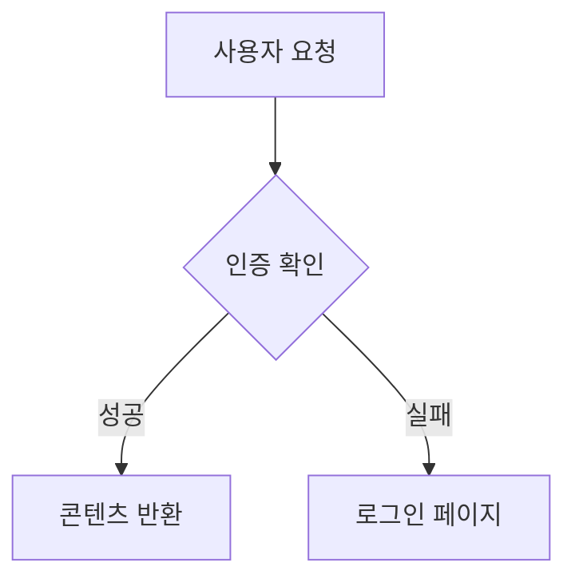

# Blog Project Specification

> 개인 기술 블로그 프로젝트 종합 스펙 문서
> 최종 수정: 2026-03-15

---

## 1. Project Overview & Goals

개인 기술 블로그를 정적 사이트로 구축한다. TIL, 프로젝트 회고, 기술 아티클을 한국어/영어로 작성하고 공유하는 것이 목적이다.

### 핵심 목표

- **빠른 정적 사이트**: Zero-JS 기본, 필요한 곳만 선택적 하이드레이션
- **MDX 기반 콘텐츠**: Frontmatter + MDX로 구조화된 글 작성
- **MCP 연동**: Claude Code에서 직접 글 작성/편집/관리
- **세련된 UI**: shadcn/ui + React Bits로 모던한 인터페이스
- **CMS 마이그레이션 대비**: Content Abstraction Layer로 향후 헤드리스 CMS 전환 가능
- **이중언어 지원**: 한국어(기본) + 영어

---

## 2. Tech Stack Rationale

| 기술             | 역할                | 선택 이유                                                  |
| ---------------- | ------------------- | ---------------------------------------------------------- |
| **Astro**        | SSG 프레임워크      | Zero-JS 기본, 아일랜드 아키텍처, Content Collections 내장  |
| **Vite**         | 번들러              | Astro 내장, 빠른 HMR, ES 모듈 기반                         |
| **TypeScript**   | 언어                | 타입 안전성 (Zod 스키마, 컴포넌트 Props)                   |
| **Tailwind CSS** | 스타일링            | 유틸리티 우선, shadcn/ui 호환, 다크모드 지원               |
| **shadcn/ui**    | 컴포넌트 라이브러리 | 복사-붙여넣기 방식(vendor lock-in 없음), Radix 기반 접근성 |
| **React Bits**   | 애니메이션          | 히어로 섹션, 텍스트 효과 등 인터랙티브 요소                |
| **Vercel**       | 호스팅              | Astro 배포 최적화, 프리뷰 배포, Edge Network               |

---

## 3. Architecture

### 3.1 Astro Island Architecture

Astro의 아일랜드 아키텍처를 활용하여 정적 셸과 인터랙티브 아일랜드를 명확히 분리한다.

```
┌─────────────────────────────────────────────────┐
│  Static Shell (.astro)                          │
│  - Layout, Navigation, Content Rendering        │
│  - Zero JavaScript shipped to client            │
│                                                 │
│  ┌──────────┐  ┌──────────┐  ┌──────────────┐  │
│  │ React    │  │ React    │  │ React        │  │
│  │ Island   │  │ Island   │  │ Island       │  │
│  │ (Theme)  │  │ (Search) │  │ (Animation)  │  │
│  │ client:  │  │ client:  │  │ client:      │  │
│  │ load     │  │ idle     │  │ visible      │  │
│  └──────────┘  └──────────┘  └──────────────┘  │
└─────────────────────────────────────────────────┘
```

#### 하이드레이션 디렉티브 전략

| 디렉티브         | 사용처                                 | 이유                              |
| ---------------- | -------------------------------------- | --------------------------------- |
| `client:load`    | ThemeToggle, 모바일 네비게이션         | 페이지 로드 즉시 인터랙션 필요    |
| `client:visible` | React Bits 애니메이션                  | 뷰포트 진입 시 로드 (성능 최적화) |
| `client:idle`    | TOC, CopyCode 버튼, 검색 모달          | 메인 스레드 여유 시 로드          |
| No directive     | Card, Badge 등 순수 스타일링 shadcn/ui | SSR만으로 충분, JS 불필요         |

### 3.2 Content Abstraction Layer

페이지와 컴포넌트가 Astro의 `astro:content` API를 직접 사용하지 않도록 추상화 계층을 둔다. CMS 전환 시 로더만 교체하면 된다.

```typescript
// src/lib/content/types.ts
export interface Post {
  slug: string;
  title: string;
  description: string;
  category: "til" | "retrospective" | "article" | "tutorial";
  tags: string[];
  publishedDate: Date;
  updatedDate?: Date;
  draft: boolean;
  coverImage?: string;
  series?: string;
  seriesOrder?: number;
  locale: "ko" | "en";
  body: string;
}

export interface ContentService {
  getPost(slug: string, locale?: string): Promise<Post | null>;
  getAllPosts(locale?: string): Promise<Post[]>;
  getPostsByTag(tag: string, locale?: string): Promise<Post[]>;
  getPostsByCategory(category: string, locale?: string): Promise<Post[]>;
  getAllTags(locale?: string): Promise<string[]>;
  getAllCategories(): Promise<string[]>;
}
```

```typescript
// src/lib/content/astro-loader.ts
import { getCollection, getEntry } from "astro:content";
import type { ContentService, Post } from "./types";

export class AstroContentLoader implements ContentService {
  async getPost(slug: string, locale: string = "ko"): Promise<Post | null> {
    const entry = await getEntry("blog", `${locale}/${slug}`);
    if (!entry) return null;
    return this.mapEntry(entry, locale);
  }

  async getAllPosts(locale: string = "ko"): Promise<Post[]> {
    const entries = await getCollection("blog", (entry) => {
      return entry.id.startsWith(`${locale}/`) && !entry.data.draft;
    });
    return entries
      .map((e) => this.mapEntry(e, locale))
      .sort((a, b) => b.publishedDate.getTime() - a.publishedDate.getTime());
  }

  async getPostsByTag(tag: string, locale: string = "ko"): Promise<Post[]> {
    const posts = await this.getAllPosts(locale);
    return posts.filter((p) => p.tags.includes(tag));
  }

  async getPostsByCategory(
    category: string,
    locale: string = "ko",
  ): Promise<Post[]> {
    const posts = await this.getAllPosts(locale);
    return posts.filter((p) => p.category === category);
  }

  async getAllTags(locale: string = "ko"): Promise<string[]> {
    const posts = await this.getAllPosts(locale);
    const tags = new Set(posts.flatMap((p) => p.tags));
    return [...tags].sort();
  }

  async getAllCategories(): Promise<string[]> {
    return ["til", "retrospective", "article", "tutorial"];
  }

  private mapEntry(entry: any, locale: string): Post {
    return {
      slug: entry.id.replace(`${locale}/`, ""),
      locale: locale as "ko" | "en",
      body: entry.body,
      ...entry.data,
    };
  }
}
```

```typescript
// src/lib/content/index.ts
import { AstroContentLoader } from "./astro-loader";
import type { ContentService } from "./types";

// v1: Astro Content Collections
// Future: swap to CMSLoader (Sanity, Contentful, etc.)
export const contentService: ContentService = new AstroContentLoader();
export type { ContentService, Post } from "./types";
```

### 3.3 MCP Server Architecture

Claude Code에서 블로그 글을 직접 작성/편집/관리할 수 있도록 MCP 서버를 구축한다.

- **서버명**: `blog-mcp`
- **Transport**: stdio
- **등록**: `.mcp.json`
- **구현**: Node.js + `@modelcontextprotocol/sdk` + `gray-matter`

#### .mcp.json

```json
{
  "mcpServers": {
    "blog-mcp": {
      "command": "node",
      "args": ["mcp-server/dist/index.js"],
      "env": {
        "BLOG_CONTENT_DIR": "src/content/blog"
      }
    }
  }
}
```

#### MCP Tools 정의

##### `create_post`

새 MDX 파일과 프론트매터를 생성한다.

```json
{
  "name": "create_post",
  "description": "Create a new blog post MDX file with frontmatter",
  "inputSchema": {
    "type": "object",
    "properties": {
      "slug": {
        "type": "string",
        "description": "URL-friendly post identifier (e.g., 'my-first-post')"
      },
      "title": {
        "type": "string",
        "maxLength": 100,
        "description": "Post title"
      },
      "description": {
        "type": "string",
        "maxLength": 300,
        "description": "Post description for SEO and previews"
      },
      "category": {
        "type": "string",
        "enum": ["til", "retrospective", "article", "tutorial"],
        "description": "Post category"
      },
      "tags": {
        "type": "array",
        "items": { "type": "string" },
        "description": "Post tags"
      },
      "locale": {
        "type": "string",
        "enum": ["ko", "en"],
        "default": "ko",
        "description": "Post language"
      },
      "draft": {
        "type": "boolean",
        "default": true,
        "description": "Whether the post is a draft"
      },
      "body": {
        "type": "string",
        "description": "MDX content body"
      },
      "series": {
        "type": "string",
        "description": "Series name if part of a series"
      },
      "seriesOrder": {
        "type": "number",
        "description": "Order within the series"
      }
    },
    "required": ["slug", "title", "description", "category", "locale"]
  }
}
```

##### `edit_post_metadata`

기존 포스트의 프론트매터를 수정한다.

```json
{
  "name": "edit_post_metadata",
  "description": "Edit frontmatter fields of an existing blog post",
  "inputSchema": {
    "type": "object",
    "properties": {
      "slug": { "type": "string", "description": "Post slug" },
      "locale": { "type": "string", "enum": ["ko", "en"], "default": "ko" },
      "updates": {
        "type": "object",
        "description": "Frontmatter fields to update",
        "properties": {
          "title": { "type": "string", "maxLength": 100 },
          "description": { "type": "string", "maxLength": 300 },
          "category": {
            "type": "string",
            "enum": ["til", "retrospective", "article", "tutorial"]
          },
          "tags": { "type": "array", "items": { "type": "string" } },
          "draft": { "type": "boolean" },
          "coverImage": { "type": "string" },
          "series": { "type": "string" },
          "seriesOrder": { "type": "number" }
        }
      }
    },
    "required": ["slug", "updates"]
  }
}
```

##### `list_posts`

필터링된 포스트 목록을 반환한다.

```json
{
  "name": "list_posts",
  "description": "List blog posts with optional filters",
  "inputSchema": {
    "type": "object",
    "properties": {
      "locale": { "type": "string", "enum": ["ko", "en"], "default": "ko" },
      "category": {
        "type": "string",
        "enum": ["til", "retrospective", "article", "tutorial"]
      },
      "tag": { "type": "string" },
      "draft": { "type": "boolean", "description": "Filter by draft status" },
      "limit": { "type": "number", "default": 20 },
      "offset": { "type": "number", "default": 0 }
    }
  }
}
```

##### `get_post`

포스트 전체 내용(프론트매터 + 본문)을 조회한다.

```json
{
  "name": "get_post",
  "description": "Get full content of a blog post including frontmatter and body",
  "inputSchema": {
    "type": "object",
    "properties": {
      "slug": { "type": "string", "description": "Post slug" },
      "locale": { "type": "string", "enum": ["ko", "en"], "default": "ko" }
    },
    "required": ["slug"]
  }
}
```

##### `publish_post`

draft 상태를 published로 전환한다.

```json
{
  "name": "publish_post",
  "description": "Change post status from draft to published, setting publishedDate to now",
  "inputSchema": {
    "type": "object",
    "properties": {
      "slug": { "type": "string", "description": "Post slug" },
      "locale": { "type": "string", "enum": ["ko", "en"], "default": "ko" }
    },
    "required": ["slug"]
  }
}
```

##### `delete_post`

포스트를 `_archive/` 디렉토리로 소프트 삭제한다. 복구 가능.

```json
{
  "name": "delete_post",
  "description": "Soft-delete a post by moving it to _archive/ directory",
  "inputSchema": {
    "type": "object",
    "properties": {
      "slug": { "type": "string", "description": "Post slug" },
      "locale": { "type": "string", "enum": ["ko", "en"], "default": "ko" }
    },
    "required": ["slug"]
  }
}
```

##### `list_tags`

사용 중인 태그 목록과 포스트 수를 반환한다.

```json
{
  "name": "list_tags",
  "description": "List all tags with post counts",
  "inputSchema": {
    "type": "object",
    "properties": {
      "locale": { "type": "string", "enum": ["ko", "en"], "default": "ko" }
    }
  }
}
```

##### `list_categories`

카테고리별 포스트 수를 반환한다.

```json
{
  "name": "list_categories",
  "description": "List all categories with post counts",
  "inputSchema": {
    "type": "object",
    "properties": {
      "locale": { "type": "string", "enum": ["ko", "en"], "default": "ko" }
    }
  }
}
```

---

## 4. Directory Structure

```
/
├── .mcp.json                     # MCP 서버 등록
├── astro.config.ts               # Astro 설정
├── tailwind.config.ts            # Tailwind 설정
├── components.json               # shadcn/ui 설정
├── tsconfig.json
├── package.json
├── pnpm-lock.yaml
│
├── public/
│   ├── fonts/                    # 커스텀 폰트
│   └── og/                      # 정적 OG 이미지 (fallback)
│
├── src/
│   ├── content/
│   │   └── blog/
│   │       ├── ko/               # 한국어 포스트 (.mdx)
│   │       ├── en/               # 영어 포스트 (.mdx)
│   │       └── _archive/         # 소프트 삭제된 포스트
│   │
│   ├── content.config.ts         # Zod 스키마 정의
│   │
│   ├── components/
│   │   ├── ui/                   # shadcn/ui 컴포넌트 (React)
│   │   │   ├── button.tsx
│   │   │   ├── card.tsx
│   │   │   ├── badge.tsx
│   │   │   ├── input.tsx
│   │   │   └── dialog.tsx
│   │   ├── islands/              # React islands (인터랙티브)
│   │   │   ├── ThemeToggle.tsx
│   │   │   ├── SearchModal.tsx
│   │   │   ├── TableOfContents.tsx
│   │   │   ├── CopyCodeButton.tsx
│   │   │   └── MobileNav.tsx
│   │   ├── layout/              # Astro 레이아웃 컴포넌트
│   │   │   ├── Header.astro
│   │   │   ├── Footer.astro
│   │   │   ├── BaseHead.astro
│   │   │   └── LanguageToggle.astro
│   │   ├── blog/                # Astro 블로그 컴포넌트
│   │   │   ├── PostCard.astro
│   │   │   ├── PostList.astro
│   │   │   ├── TagList.astro
│   │   │   ├── CategoryFilter.astro
│   │   │   ├── Pagination.astro
│   │   │   └── PostNavigation.astro
│   │   └── mdx/                 # 커스텀 MDX 컴포넌트
│   │       ├── Callout.tsx
│   │       ├── CodeBlock.tsx
│   │       ├── MermaidDiagram.tsx  # Mermaid 다이어그램 렌더러
│   │       ├── LinkCard.tsx
│   │       └── Image.astro
│   │
│   ├── layouts/
│   │   ├── BaseLayout.astro      # 공통 레이아웃 (HTML 셸)
│   │   ├── BlogPostLayout.astro  # 포스트 상세 레이아웃
│   │   └── PageLayout.astro      # 일반 페이지 레이아웃
│   │
│   ├── lib/
│   │   ├── content/              # Content Abstraction Layer
│   │   │   ├── index.ts          # ContentService 싱글톤 export
│   │   │   ├── types.ts          # Post, ContentService 인터페이스
│   │   │   └── astro-loader.ts   # Astro Content Collections 구현
│   │   ├── utils.ts              # 유틸리티 (날짜 포맷, 읽기 시간 등)
│   │   └── constants.ts          # 상수 (사이트 메타, 페이지네이션 등)
│   │
│   ├── i18n/
│   │   ├── index.ts              # i18n 유틸 (t 함수, locale 감지)
│   │   ├── ko.ts                 # 한국어 UI 문자열
│   │   └── en.ts                 # 영어 UI 문자열
│   │
│   ├── pages/
│   │   ├── index.astro           # 홈 (한국어 기본)
│   │   ├── about.astro           # 소개
│   │   ├── blog/
│   │   │   ├── index.astro       # 블로그 목록
│   │   │   ├── [...slug].astro   # 포스트 상세
│   │   │   └── tags/
│   │   │       ├── index.astro   # 전체 태그 목록
│   │   │       └── [tag].astro   # 태그별 필터
│   │   ├── en/                   # 영어 페이지 (미러 구조)
│   │   │   ├── index.astro
│   │   │   ├── about.astro
│   │   │   └── blog/
│   │   │       ├── index.astro
│   │   │       ├── [...slug].astro
│   │   │       └── tags/
│   │   │           ├── index.astro
│   │   │           └── [tag].astro
│   │   ├── rss.xml.ts            # 한국어 RSS
│   │   ├── en/rss.xml.ts         # 영어 RSS
│   │   └── og/[...slug].png.ts   # 동적 OG 이미지
│   │
│   └── styles/
│       └── globals.css           # Tailwind + shadcn 테마 변수
│
├── mcp-server/                   # MCP 서버 (별도 패키지)
│   ├── package.json
│   ├── tsconfig.json
│   └── src/
│       ├── index.ts              # MCP 서버 엔트리
│       └── tools/
│           ├── create-post.ts
│           ├── edit-post-metadata.ts
│           ├── list-posts.ts
│           ├── get-post.ts
│           ├── publish-post.ts
│           ├── delete-post.ts
│           ├── list-tags.ts
│           └── list-categories.ts
│
└── docs/
    └── spec.md                   # ← 이 문서
```

---

## 5. Content Schema (Zod)

`src/content.config.ts`에서 Astro Content Collections 스키마를 정의한다.

```typescript
// src/content.config.ts
import { defineCollection, z } from "astro:content";

const blog = defineCollection({
  type: "content",
  schema: z.object({
    title: z.string().max(100),
    description: z.string().max(300),
    category: z.enum(["til", "retrospective", "article", "tutorial"]),
    tags: z.array(z.string()).default([]),
    publishedDate: z.coerce.date(),
    updatedDate: z.coerce.date().optional(),
    draft: z.boolean().default(false),
    coverImage: z.string().optional(),
    series: z.string().optional(),
    seriesOrder: z.number().optional(),
  }),
});

export const collections = { blog };
```

### 카테고리 정의

| 카테고리        | 설명                             | 예시                          |
| --------------- | -------------------------------- | ----------------------------- |
| `til`           | Today I Learned - 짧은 학습 기록 | 새로 알게 된 API, 트릭        |
| `retrospective` | 프로젝트 회고                    | 프로젝트 후기, 실패/성공 분석 |
| `article`       | 기술 아티클                      | 깊이 있는 기술 분석, 비교     |
| `tutorial`      | 튜토리얼                         | 단계별 가이드, How-to         |

### 프론트매터 예시

```yaml
---
title: "Astro 아일랜드 아키텍처 이해하기"
description: "Astro의 아일랜드 아키텍처가 어떻게 Zero-JS 정적 사이트를 만드는지 알아봅니다"
category: "article"
tags: ["astro", "architecture", "performance"]
publishedDate: 2026-03-15
draft: false
coverImage: "/og/astro-islands.png"
series: "Astro 딥다이브"
seriesOrder: 1
---
```

---

## 6. Pages & Routes

### 라우팅 구조

| Route (ko - 기본)   | Route (en)            | 설명                                   |
| ------------------- | --------------------- | -------------------------------------- |
| `/`                 | `/en`                 | 홈 - 히어로 + 최신 글 + 카테고리       |
| `/blog`             | `/en/blog`            | 블로그 목록 (페이지네이션 + 태그 필터) |
| `/blog/[slug]`      | `/en/blog/[slug]`     | 포스트 상세 (MDX + TOC + prev/next)    |
| `/blog/tags`        | `/en/blog/tags`       | 전체 태그 목록                         |
| `/blog/tags/[tag]`  | `/en/blog/tags/[tag]` | 태그별 필터링                          |
| `/about`            | `/en/about`           | 소개 페이지                            |
| `/rss.xml`          | `/en/rss.xml`         | RSS 피드                               |
| `/og/[...slug].png` | -                     | 동적 OG 이미지 (빌드 타임)             |

### i18n 전략

- **기본 언어**: 한국어 (프리픽스 없음)
- **영어**: `/en` 프리픽스
- **언어 전환**: Header에 토글 배치
- **SEO**: `hreflang` 태그로 대체 언어 페이지 연결
- **콘텐츠 분리**: `src/content/blog/ko/`, `src/content/blog/en/` 병렬 디렉토리
- **UI 문자열**: `src/i18n/` 디렉토리에서 관리

```typescript
// src/i18n/index.ts
export type Locale = "ko" | "en";
export const defaultLocale: Locale = "ko";

export function getLocaleFromUrl(url: URL): Locale {
  const [, locale] = url.pathname.split("/");
  return locale === "en" ? "en" : "ko";
}

export function t(key: string, locale: Locale): string {
  const translations = locale === "ko" ? ko : en;
  return translations[key] ?? key;
}

export function getLocalizedPath(path: string, locale: Locale): string {
  if (locale === "ko") return path;
  return `/en${path}`;
}
```

```typescript
// src/i18n/ko.ts
export default {
  "nav.home": "홈",
  "nav.blog": "블로그",
  "nav.about": "소개",
  "blog.readMore": "더 읽기",
  "blog.publishedOn": "작성일",
  "blog.updatedOn": "수정일",
  "blog.minuteRead": "분 소요",
  "blog.tags": "태그",
  "blog.allPosts": "전체 글",
  "blog.prevPost": "이전 글",
  "blog.nextPost": "다음 글",
  "search.placeholder": "검색어를 입력하세요...",
  "search.noResults": "검색 결과가 없습니다",
} as const;
```

```typescript
// src/i18n/en.ts
export default {
  "nav.home": "Home",
  "nav.blog": "Blog",
  "nav.about": "About",
  "blog.readMore": "Read more",
  "blog.publishedOn": "Published on",
  "blog.updatedOn": "Updated on",
  "blog.minuteRead": "min read",
  "blog.tags": "Tags",
  "blog.allPosts": "All Posts",
  "blog.prevPost": "Previous",
  "blog.nextPost": "Next",
  "search.placeholder": "Search...",
  "search.noResults": "No results found",
} as const;
```

---

## 7. Design System

### 다크모드

- **방식**: class 기반 (`darkMode: "class"` in Tailwind config)
- **저장**: `localStorage`에 사용자 선택 저장
- **초기값**: `prefers-color-scheme` 미디어 쿼리 fallback
- **FOUC 방지**: `<head>`에 인라인 스크립트로 초기 클래스 설정

```html
<!-- BaseHead.astro - FOUC 방지 인라인 스크립트 -->
<script is:inline>
  const theme = (() => {
    const stored = localStorage.getItem("theme");
    if (stored === "dark" || stored === "light") return stored;
    return window.matchMedia("(prefers-color-scheme: dark)").matches
      ? "dark"
      : "light";
  })();
  document.documentElement.classList.toggle("dark", theme === "dark");
</script>
```

### Typography

- `@tailwindcss/typography` 플러그인으로 MDX 콘텐츠 스타일링
- `prose` / `dark:prose-invert` 클래스 사용
- 커스텀 `prose` 확장으로 코드 블록, 인용 등 스타일 조정

### 코드 하이라이팅

- **엔진**: Shiki (Astro 내장)
- **테마**: CSS Variables 테마 (Tailwind 다크모드와 연동)
- **기능**: 라인 넘버, 라인 하이라이팅, 파일명 표시, 복사 버튼

```typescript
// astro.config.ts (shiki 설정 부분)
export default defineConfig({
  markdown: {
    shikiConfig: {
      themes: {
        light: "github-light",
        dark: "github-dark",
      },
    },
  },
});
```

### Mermaid 다이어그램

MDX 콘텐츠에서 Mermaid 다이어그램을 지원한다. `rehype-mermaid`를 사용하여 빌드 타임에 SVG로 변환하는 방식과, 클라이언트 사이드 렌더링 방식 중 **빌드 타임 변환**을 채택한다 (Zero-JS 원칙 유지).

- **방식**: `rehype-mermaid` (빌드 타임 SVG 변환, JS 미전송)
- **Fallback**: `MermaidDiagram.tsx` 컴포넌트로 클라이언트 렌더링도 가능 (복잡한 인터랙티브 다이어그램용)
- **다크모드**: CSS `filter` 또는 Mermaid 테마 변수로 라이트/다크 대응
- **지원 다이어그램**: flowchart, sequence, class, state, ER, gantt, pie, mindmap 등

#### 사용법 (MDX)

**방법 1: 코드 펜스 (빌드 타임 변환, 권장)**

````mdx

````

**방법 2: 컴포넌트 (클라이언트 렌더링, 인터랙티브 필요 시)**

```mdx
import { MermaidDiagram } from "@/components/mdx/MermaidDiagram";

<MermaidDiagram
  client:visible
  chart={`
  sequenceDiagram
    Client->>+Server: POST /api/login
    Server-->>-Client: JWT Token
`}
/>
```

#### Astro 설정 (rehype-mermaid)

```typescript
// astro.config.ts (markdown 설정에 추가)
import rehypeMermaid from "rehype-mermaid";

export default defineConfig({
  markdown: {
    rehypePlugins: [[rehypeMermaid, { strategy: "pre-mermaid" }]],
  },
});
```

#### MermaidDiagram 컴포넌트 (Fallback)

```tsx
// src/components/mdx/MermaidDiagram.tsx
// 클라이언트 사이드 렌더링이 필요한 경우에만 사용
// mermaid.render()는 자체적으로 sanitized SVG를 생성하므로
// DOMPurify 등 별도 sanitizer 없이 사용 가능
// 참고: https://mermaid.js.org/config/usage.html#security
import { useEffect, useRef } from "react";
import mermaid from "mermaid";

interface Props {
  chart: string;
}

export function MermaidDiagram({ chart }: Props) {
  const containerRef = useRef<HTMLDivElement>(null);

  useEffect(() => {
    if (!containerRef.current) return;

    mermaid.initialize({
      startOnLoad: false,
      theme: document.documentElement.classList.contains("dark")
        ? "dark"
        : "default",
      fontFamily: "inherit",
      securityLevel: "strict",
    });

    const id = `mermaid-${Math.random().toString(36).slice(2, 9)}`;
    mermaid.render(id, chart).then(({ svg, bindFunctions }) => {
      if (!containerRef.current) return;
      containerRef.current.textContent = "";
      const parser = new DOMParser();
      const doc = parser.parseFromString(svg, "image/svg+xml");
      const svgEl = doc.documentElement;
      containerRef.current.appendChild(svgEl);
      bindFunctions?.(svgEl);
    });
  }, [chart]);

  return (
    <div
      ref={containerRef}
      className="mermaid-diagram my-6 flex justify-center"
    />
  );
}
```

### React Bits 사용

인터랙티브 요소에 3-5개 선별 사용, `client:visible`로 로드:

- 히어로 섹션 텍스트 애니메이션
- 스크롤 트리거 요소 효과
- 페이지 전환 효과 (선택적)

### shadcn/ui 테마 변수

```css
/* src/styles/globals.css */
@tailwind base;
@tailwind components;
@tailwind utilities;

@layer base {
  :root {
    --background: 0 0% 100%;
    --foreground: 240 10% 3.9%;
    --card: 0 0% 100%;
    --card-foreground: 240 10% 3.9%;
    --popover: 0 0% 100%;
    --popover-foreground: 240 10% 3.9%;
    --primary: 240 5.9% 10%;
    --primary-foreground: 0 0% 98%;
    --secondary: 240 4.8% 95.9%;
    --secondary-foreground: 240 5.9% 10%;
    --muted: 240 4.8% 95.9%;
    --muted-foreground: 240 3.8% 46.1%;
    --accent: 240 4.8% 95.9%;
    --accent-foreground: 240 5.9% 10%;
    --destructive: 0 84.2% 60.2%;
    --destructive-foreground: 0 0% 98%;
    --border: 240 5.9% 90%;
    --input: 240 5.9% 90%;
    --ring: 240 5.9% 10%;
    --radius: 0.5rem;
  }

  .dark {
    --background: 240 10% 3.9%;
    --foreground: 0 0% 98%;
    --card: 240 10% 3.9%;
    --card-foreground: 0 0% 98%;
    --popover: 240 10% 3.9%;
    --popover-foreground: 0 0% 98%;
    --primary: 0 0% 98%;
    --primary-foreground: 240 5.9% 10%;
    --secondary: 240 3.7% 15.9%;
    --secondary-foreground: 0 0% 98%;
    --muted: 240 3.7% 15.9%;
    --muted-foreground: 240 5% 64.9%;
    --accent: 240 3.7% 15.9%;
    --accent-foreground: 0 0% 98%;
    --destructive: 0 62.8% 30.6%;
    --destructive-foreground: 0 0% 98%;
    --border: 240 3.7% 15.9%;
    --input: 240 3.7% 15.9%;
    --ring: 240 4.9% 83.9%;
  }
}
```

---

## 8. SEO & Distribution

### 메타 태그 관리

`BaseHead.astro`에서 모든 메타 태그를 중앙 관리한다.

```astro
---
// src/components/layout/BaseHead.astro
interface Props {
  title: string;
  description: string;
  image?: string;
  type?: "website" | "article";
  publishedDate?: Date;
  updatedDate?: Date;
  locale?: "ko" | "en";
  alternateLocale?: string;
  alternatePath?: string;
}

const {
  title,
  description,
  image = "/og/default.png",
  type = "website",
  publishedDate,
  updatedDate,
  locale = "ko",
  alternateLocale,
  alternatePath,
} = Astro.props;

const canonicalUrl = new URL(Astro.url.pathname, Astro.site);
const ogImageUrl = new URL(image, Astro.site);
---

<meta charset="utf-8" />
<meta name="viewport" content="width=device-width, initial-scale=1" />
<meta name="generator" content={Astro.generator} />

<title>{title}</title>
<meta name="description" content={description} />
<link rel="canonical" href={canonicalUrl} />

<!-- Open Graph -->
<meta property="og:type" content={type} />
<meta property="og:url" content={canonicalUrl} />
<meta property="og:title" content={title} />
<meta property="og:description" content={description} />
<meta property="og:image" content={ogImageUrl} />
<meta property="og:locale" content={locale === "ko" ? "ko_KR" : "en_US"} />

<!-- Twitter -->
<meta name="twitter:card" content="summary_large_image" />
<meta name="twitter:title" content={title} />
<meta name="twitter:description" content={description} />
<meta name="twitter:image" content={ogImageUrl} />

<!-- Article metadata -->
{
  publishedDate && (
    <meta
      property="article:published_time"
      content={publishedDate.toISOString()}
    />
  )
}
{
  updatedDate && (
    <meta
      property="article:modified_time"
      content={updatedDate.toISOString()}
    />
  )
}

<!-- Alternate language -->
{
  alternateLocale && alternatePath && (
    <link
      rel="alternate"
      hreflang={alternateLocale}
      href={new URL(alternatePath, Astro.site)}
    />
  )
}

<!-- RSS -->
<link
  rel="alternate"
  type="application/rss+xml"
  title="RSS (한국어)"
  href="/rss.xml"
/>
<link
  rel="alternate"
  type="application/rss+xml"
  title="RSS (English)"
  href="/en/rss.xml"
/>

<!-- Sitemap -->
<link rel="sitemap" href="/sitemap-index.xml" />
```

### JSON-LD 구조화 데이터

```astro
<!-- BlogPosting (포스트 상세 페이지) -->
<script
  type="application/ld+json"
  set:html={JSON.stringify({
    "@context": "https://schema.org",
    "@type": "BlogPosting",
    headline: post.title,
    description: post.description,
    datePublished: post.publishedDate.toISOString(),
    dateModified: (post.updatedDate ?? post.publishedDate).toISOString(),
    author: {
      "@type": "Person",
      name: "Jaeha Yi",
      url: Astro.site,
    },
    image: ogImageUrl,
    mainEntityOfPage: canonicalUrl,
  })}
/>
```

### RSS 피드

```typescript
// src/pages/rss.xml.ts
import rss from "@astrojs/rss";
import { contentService } from "@/lib/content";
import { SITE } from "@/lib/constants";

export async function GET(context: { site: URL }) {
  const posts = await contentService.getAllPosts("ko");
  return rss({
    title: SITE.title,
    description: SITE.description,
    site: context.site,
    items: posts.map((post) => ({
      title: post.title,
      pubDate: post.publishedDate,
      description: post.description,
      link: `/blog/${post.slug}`,
    })),
  });
}
```

### 동적 OG 이미지

`satori` + `sharp`로 빌드 타임에 OG 이미지를 생성한다. 1200×630 PNG 형식.

#### 이미지 종류

| 종류      | 경로                  | 내용                                                                       |
| --------- | --------------------- | -------------------------------------------------------------------------- |
| 기본 OG   | `/og-default.png`     | 사이트 제목 + 설명. 홈, 소개, 블로그 목록 등 포스트가 아닌 페이지에서 사용 |
| 포스트 OG | `/og/blog/{slug}.png` | 포스트 제목 + 카테고리 + 사이트명. 빌드 타임에 포스트별 자동 생성          |

#### 폴백 전략

1. 포스트에 `coverImage`가 설정되어 있으면 해당 이미지 사용
2. `coverImage`가 없으면 자동 생성된 `/og/blog/{slug}.png` 사용
3. 일반 페이지(홈, 소개 등)는 `/og-default.png` 사용

`BlogPostLayout`에서 `coverImage`가 없는 경우 자동으로 동적 OG 이미지 경로를 주입한다.

#### 기본 OG 이미지 생성

`src/pages/og-default.png.ts`에서 사이트 제목으로 기본 OG 이미지를 빌드 타임에 생성한다. 포스트 OG와 동일한 디자인 시스템(그라데이션 배경, Inter 폰트)을 공유한다.

### Sitemap

`@astrojs/sitemap` 통합으로 자동 생성.

```typescript
// astro.config.ts
import sitemap from "@astrojs/sitemap";

export default defineConfig({
  site: "https://your-blog.vercel.app",
  integrations: [sitemap()],
});
```

---

## 9. Search

### Pagefind (v1)

빌드 타임에 정적 검색 인덱스를 생성하는 Pagefind를 v1에 포함한다.

- **인덱싱**: 빌드 후 HTML 출력물에서 자동 인덱스 생성
- **한국어 지원**: CJK 토크나이저 활성화
- **영어 지원**: 기본 토크나이저
- **UI**: 커스텀 SearchModal (React island, `client:idle`)

```typescript
// astro.config.ts
export default defineConfig({
  build: {
    format: "directory",
  },
  integrations: [
    // Pagefind는 빌드 후 postbuild 스크립트로 실행
  ],
});
```

```json
// package.json (scripts 부분)
{
  "scripts": {
    "build": "astro build && pagefind --site dist",
    "postbuild": "pagefind --site dist"
  }
}
```

---

## 10. Development & Deployment

### 패키지 매니저

**pnpm** 사용.

```json
{
  "packageManager": "pnpm@9.x"
}
```

### 주요 의존성

```json
{
  "dependencies": {
    "astro": "^5.x",
    "@astrojs/react": "^4.x",
    "@astrojs/tailwind": "^6.x",
    "@astrojs/sitemap": "^4.x",
    "@astrojs/rss": "^4.x",
    "@astrojs/vercel": "^8.x",
    "react": "^19.x",
    "react-dom": "^19.x",
    "tailwindcss": "^4.x",
    "@tailwindcss/typography": "^0.5.x",
    "mermaid": "^11.x",
    "pagefind": "^1.x",
    "satori": "^0.x",
    "sharp": "^0.33.x"
  },
  "devDependencies": {
    "typescript": "^5.x",
    "@types/react": "^19.x",
    "eslint": "^9.x",
    "prettier": "^3.x",
    "prettier-plugin-astro": "^0.x",
    "prettier-plugin-tailwindcss": "^0.x",
    "husky": "^9.x",
    "lint-staged": "^15.x",
    "rehype-mermaid": "^3.x"
  }
}
```

### 린팅 & 포맷팅

- **ESLint**: Astro + TypeScript + React 룰
- **Prettier**: Astro + Tailwind 플러그인
- **Git Hooks**: Husky + lint-staged

```json
// lint-staged 설정
{
  "lint-staged": {
    "*.{ts,tsx,astro}": ["eslint --fix", "prettier --write"],
    "*.{css,md,mdx,json}": ["prettier --write"]
  }
}
```

### Astro 설정

```typescript
// astro.config.ts
import { defineConfig } from "astro/config";
import react from "@astrojs/react";
import tailwind from "@astrojs/tailwind";
import sitemap from "@astrojs/sitemap";
import vercel from "@astrojs/vercel";

export default defineConfig({
  site: "https://your-blog.vercel.app",
  output: "static",
  adapter: vercel(),
  integrations: [
    react(),
    tailwind({
      applyBaseStyles: false, // globals.css에서 직접 관리
    }),
    sitemap(),
  ],
  markdown: {
    shikiConfig: {
      themes: {
        light: "github-light",
        dark: "github-dark",
      },
    },
  },
  i18n: {
    defaultLocale: "ko",
    locales: ["ko", "en"],
    routing: {
      prefixDefaultLocale: false,
    },
  },
});
```

### 배포 (Vercel)

- **어댑터**: `@astrojs/vercel` (정적 출력)
- **프리뷰 배포**: PR마다 자동 프리뷰 URL
- **프로덕션**: `main` 브랜치 푸시 시 자동 배포

### CI 파이프라인

```yaml
# GitHub Actions (예시)
name: CI
on: [push, pull_request]
jobs:
  build:
    runs-on: ubuntu-latest
    steps:
      - uses: actions/checkout@v4
      - uses: pnpm/action-setup@v4
      - uses: actions/setup-node@v4
        with:
          node-version: 22
          cache: pnpm
      - run: pnpm install --frozen-lockfile
      - run: pnpm tsc --noEmit # 타입체크
      - run: pnpm eslint . # 린트
      - run: pnpm astro build # 빌드
```

---

## 11. Future Considerations (v2+)

| 기능                 | 상태 | 비고                               |
| -------------------- | ---- | ---------------------------------- |
| 댓글 시스템          | v2   | giscus (GitHub Discussions 기반)   |
| CMS 마이그레이션     | v2+  | Sanity/Contentful → CMSLoader 구현 |
| 뉴스레터             | v2+  | Buttondown/Resend 연동             |
| 조회수/좋아요        | v2+  | Upstash Redis 또는 Vercel KV       |
| 시리즈 네비게이션 UI | v1.1 | series/seriesOrder 기반            |

---

## Appendix: Constants

```typescript
// src/lib/constants.ts
export const SITE = {
  title: "Jaeha's Blog",
  description: "개인 기술 블로그 - TIL, 프로젝트 회고, 기술 아티클",
  url: "https://your-blog.vercel.app",
  author: "Jaeha Yi",
  defaultLocale: "ko" as const,
} as const;

export const PAGINATION = {
  postsPerPage: 10,
} as const;

export const CATEGORIES = {
  til: { ko: "TIL", en: "TIL" },
  retrospective: { ko: "회고", en: "Retrospective" },
  article: { ko: "아티클", en: "Article" },
  tutorial: { ko: "튜토리얼", en: "Tutorial" },
} as const;
```
