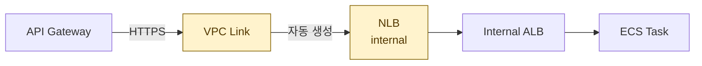
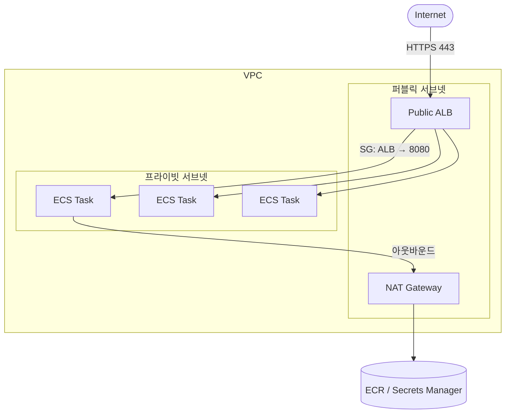
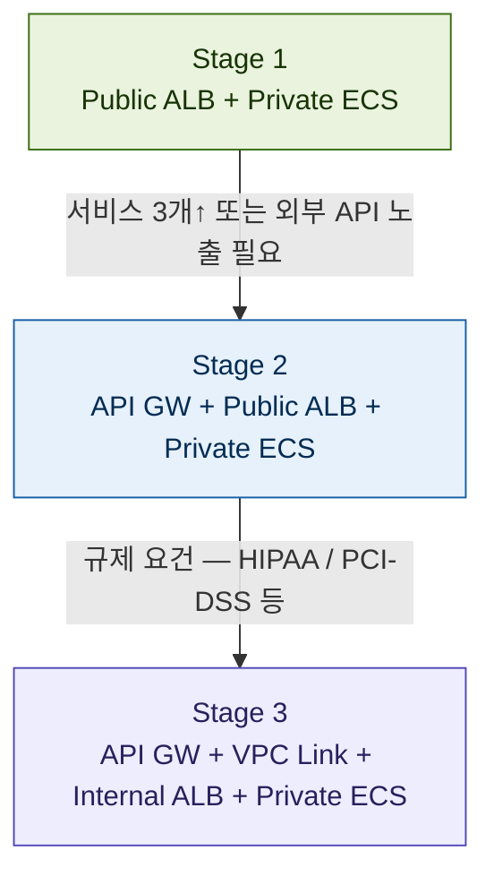

AWS에서 ECS 기반 백엔드를 구성할 때 흔히 마주치는 스택이 있다.

```
API Gateway → VPC Link → Internal ALB → Private ECS
```

교과서적으로 보면 합리적인 구성이다. 하지만 실제로 운영하다 보면 "이게 다 필요한가?" 하는 의문이 생긴다. 이 글에서는 각 레이어의 역할을 짚고, 언제 단순화할 수 있는지, 그리고 어떤 기준으로 다시 복잡도를 올려야 하는지를 정리한다.

## 각 레이어가 하는 일

### API Gateway

퍼블릭 엔드포인트 역할을 하면서 인증(JWT, API Key), throttling, 라우팅을 처리한다. 멀티 서비스 앞단에 단일 진입점을 두고 싶을 때 유용하다.

### VPC Link

API Gateway(퍼블릭)에서 VPC 내부 리소스로 연결하는 브릿지다. 내부적으로 **NLB를 자동 생성**하기 때문에, 실질적인 스택은 이렇게 된다.



> VPC Link 하나를 추가하는 것처럼 보이지만, 실제로는 NLB가 내부에 생성되어 2홉 구조가 된다. 레이턴시와 비용이 모두 올라간다.

### Internal ALB

L7 로드밸런싱, path-based routing, health check를 담당한다. ECS 서비스가 여러 개일 때 path로 분기하거나, 세밀한 health check가 필요할 때 여전히 의미 있다.

### Private ECS

컨테이너 태스크가 프라이빗 서브넷에서 실행된다. 인터넷에서 직접 접근 불가능하다.

---

## Public ALB + Private ECS로 충분한가?

결론부터 말하면 **대부분의 서비스에서 충분하다.**

ALB는 퍼블릭 서브넷, ECS는 프라이빗 서브넷에 두면 된다. 핵심은 **Security Group 설정**이다.

```
ALB SG:  inbound  0.0.0.0/0  → 443
ECS SG:  inbound  ALB SG ID  → 서비스 포트 (예: 8080)
ECS SG:  outbound 0.0.0.0/0  → 허용 (NAT 경유)
```

ECS SG의 inbound를 ALB SG ID로 지정하면 ALB를 통하지 않은 직접 접근은 전부 차단된다. IP 노출 없이 격리 효과를 낼 수 있다.



### 아웃바운드 처리

ECS가 ECR에서 이미지를 pull하거나 외부 API를 호출하려면 NAT Gateway가 필요하다. NAT Gateway는 퍼블릭 서브넷에 위치해야 한다.

비용을 줄이고 싶다면 ECR, Secrets Manager 등에 **VPC Endpoint**를 붙이는 방법도 있다. NAT 트래픽 자체를 줄일 수 있어 장기적으로 유리하다.

---

## 단계별 아키텍처 진화

아키텍처는 처음부터 완성형일 필요 없다. 실제 요건이 생길 때 단계적으로 올리는 게 낫다.



### Stage 1 — Public ALB + Private ECS

대부분의 초기~중기 서비스에 적합한 구성이다.

**구성 포인트**

- ALB: 퍼블릭 서브넷
- ECS: 프라이빗 서브넷
- SG: ALB → ECS 포트만 허용
- NAT Gateway: 아웃바운드 전용
- 인증: 앱 레벨(Spring Security 등)에서 처리

**다음 단계로 가는 기준**

- 서비스가 3개 이상으로 늘어남
- Throttling, API Key 관리 수요 발생
- 외부 파트너사에 API를 노출해야 하는 상황

### Stage 2 — API Gateway + Public ALB + Private ECS

외부 노출이나 API 관리 요건이 생겼을 때 추가한다. **VPC Link는 붙이지 않는다.**

**구성 포인트**

- API GW: throttling, API key 관리
- ALB: path-based routing (서비스 분기)
- ALB는 퍼블릭 유지 (VPC Link 없음)
- WAF는 API GW 앞에 붙임

**다음 단계로 가는 기준**

- 컴플라이언스 요건 강화
- 백엔드 IP 자체를 인터넷에 노출하면 안 되는 상황
- 금융, 의료 등 규제 산업 기준 충족 필요

### Stage 3 — API Gateway + VPC Link + Internal ALB + Private ECS

규제 대응이 명시적으로 요구될 때만 선택한다.

**구성 포인트**

- ECS IP 완전 비노출
- NLB + ALB 이중 홉 (레이턴시 소폭 증가)
- 비용 가장 높음
- HIPAA, PCI-DSS, ISO 27001 등 요건 충족

**정당화 조건**

- 규제 감사에서 백엔드 네트워크 완전 격리를 명시적으로 요구하는 경우

---

## 각 단계 비교

|                 | Stage 1          | Stage 2          | Stage 3            |
| --------------- | ---------------- | ---------------- | ------------------ |
| 비용            | ALB만            | ALB + API GW     | ALB + API GW + NLB |
| 보안 격리       | SG 기반          | SG 기반 + WAF    | 네트워크 완전 격리 |
| 인증/throttling | 앱 레벨          | API GW 기본 제공 | API GW 기본 제공   |
| 관리 복잡도     | 낮음             | 중간             | 높음               |
| 적합한 상황     | 초기~중기 서비스 | 외부 API 노출    | 규제 산업          |

---

## 과설계가 일어나는 이유

API Gateway를 처음 도입할 때의 판단은 보통 이렇다.

> "인증 중앙화, throttling, 멀티 서비스 대비해서 API GW 넣자."

교과서적으로 맞는 말이다. 하지만 API GW를 VPC 안으로 연결하려면 VPC Link가 필요하고, VPC Link를 쓰면 내부에 NLB가 생기고, 이미 ALB도 있으니 NLB + ALB 이중 구성이 된다.

"필요할 것 같아서" 넣은 레이어가 실제로 안 쓰이면서 비용과 복잡도만 올리는 케이스다. AWS 아키텍처에서 굉장히 흔하게 발생한다.

---

## 정리

- **ECS가 프라이빗 서브넷에 있어도** ALB를 통한 접근은 정상적으로 동작한다. ALB는 퍼블릭, ECS는 프라이빗 서브넷에 두고 SG로 격리하면 된다.
- **VPC Link는 규제 요건이 있을 때만** 정당화된다. 그 전에는 비용과 복잡도만 올린다.
- **API Gateway는 외부 API 관리 수요가 생겼을 때** 붙이면 된다. 처음부터 넣을 필요 없다.
- 아키텍처는 실제 요건이 생길 때 단계적으로 올리는 것이 유지보수성과 비용 모두에서 유리하다.
