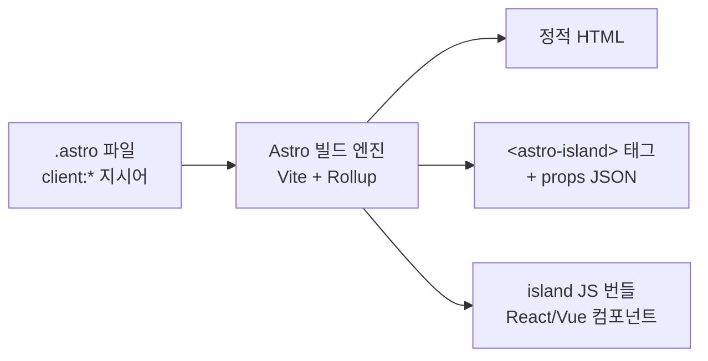
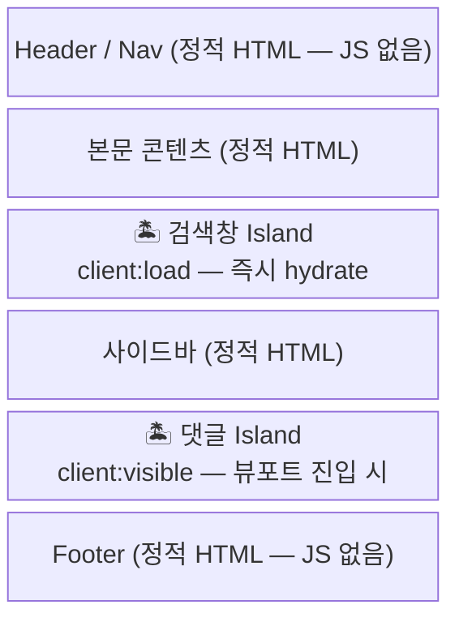
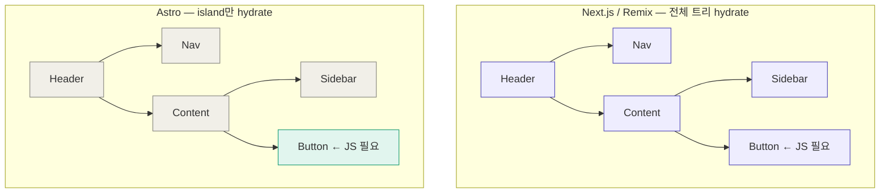

Astro를 처음 접했을 때 "Zero JS by default"라는 문구가 눈에 들어왔다.
React를 쓰는데 JS가 없다고? 그게 무슨 뜻일까.

파고들수록 Astro의 접근법이 단순한 마케팅 문구가 아니라는 걸 알게 됐다.
이 글에서는 Astro가 실제로 어떻게 동작하는지, 그리고 Next.js나 Remix와 무엇이 근본적으로 다른지를 정리한다.

---

## 핵심 철학 — "보여주는 것"과 "동작하는 것"을 분리한다

대부분의 웹 프레임워크는 페이지를 하나의 React 트리로 관리한다.
서버에서 HTML을 만들더라도, 브라우저에서 React가 그 트리를 다시 장악(hydrate)한다.

Astro는 다르다. **"이 컴포넌트가 정말 JS가 필요한가?"** 를 컴포넌트 단위로 묻는다.
필요 없으면 HTML로만 보낸다. 필요하면 그 컴포넌트만 선택적으로 활성화한다.

이게 **Islands Architecture**다.

> Islands Architecture에 대한 원본 개념은 [Katie Sylor-Miller](https://twitter.com/ksylor)가 처음 제안하고,
> [Jason Miller(Preact 제작자)가 글로 정리](https://jasonformat.com/islands-architecture/)했다.

---

## 빌드 타임 — 컴포넌트를 섬(island)으로 마킹한다

`.astro` 파일에서 UI 컴포넌트를 쓸 때 `client:*` 지시어를 붙이면 island가 된다.

```astro
---
import Header from "./Header.astro"; // 정적 — JS 없음
import SearchBar from "./SearchBar.tsx"; // island — JS 있음
import Comments from "./Comments.vue"; // island — JS 있음
---

<Header />
<SearchBar client:load />
<Comments client:visible />
```

빌드 엔진은 `client:*`가 붙은 컴포넌트를 감지하고, HTML에 `<astro-island>` 태그를 심는다.

```html
<!-- 빌드 출력 -->
<header>...</header>
<!-- 순수 HTML -->

<astro-island
  client="load"
  component-url="/_astro/SearchBar.js"
  renderer-url="/_astro/client.react.js"
  props='{"placeholder":"검색어 입력"}'
>
  <!-- SSR로 미리 렌더된 정적 HTML -->
  <input placeholder="검색어 입력" />
</astro-island>

<astro-island
  client="visible"
  component-url="/_astro/Comments.js"
  renderer-url="/_astro/client.vue.js"
  props="{}"
>
  <div class="comments">...</div>
</astro-island>
```

`props`가 JSON으로 직렬화되어 HTML에 박혀 있다. hydrate할 때 이 값을 꺼내서 컴포넌트에 넘긴다.



---

## "Zero JS"의 정확한 의미

여기서 한 가지 짚고 넘어가야 한다.

**Zero JS는 JS가 한 줄도 없다는 뜻이 아니다.**

`<astro-island>` 태그가 "스스로 동작"하려면, 그 태그를 Custom Element로 등록하는 작은 런타임 스크립트가 먼저 페이지에 있어야 한다.

```
브라우저가 받는 것
├── 대부분: 순수 정적 HTML (JS 없음)
├── ~1kb 런타임: <astro-island>를 Custom Element로 등록
└── island가 있다면: <astro-island client="..." component-url="..." />
```

Astro 런타임 스크립트(~1kb)는 항상 포함된다. 이 스크립트가 `customElements.define('astro-island', ...)`를 실행해서 브라우저가 그 태그를 인식할 수 있게 한다.

**Zero JS의 진짜 의미는 "React/Vue 같은 UI 프레임워크 런타임이 기본적으로 전송되지 않는다"는 것이다.**
island가 없는 페이지라면 ~1kb 런타임 외에 아무 JS도 전송되지 않는다.

---

## 런타임 — island가 활성화되는 흐름

브라우저에서 실제로 어떻게 동작하는지 순서대로 보면 이렇다.

```mermaid
sequenceDiagram
  participant B as 브라우저
  participant R as island 런타임 (~1kb)
  participant N as 네트워크

  B->>R: HTML 파싱 중 &lt;astro-island&gt; 태그 발견
  R->>R: connectedCallback() 호출
  R->>R: client 속성 확인 (load / idle / visible ...)
  R->>N: dynamic import(component-url)
  R->>N: dynamic import(renderer-url)
  N-->>R: JS 번들 응답
  R->>R: props JSON.parse()
  R->>B: ReactDOM.hydrateRoot(el, &lt;Component {...props} /&gt;)
  Note over B: island 인터랙티브 완료
```

`hydrateRoot`를 쓰는 이유가 중요하다. `createRoot().render()`는 기존 DOM을 삭제하고 새로 그리지만, `hydrateRoot`는 SSR로 미리 렌더된 DOM 위에 React를 "붙인다". 덕분에 island가 아직 hydrate되지 않은 상태에서도 Layout Shift 없이 콘텐츠가 보인다.

---

## 페이지 구조 — 대부분이 정적, 일부만 island

실제 페이지에서 어떻게 보이는지 구조로 표현하면 이렇다.



각 island는 서로 완전히 독립적인 Promise 체인으로 동작한다. 무거운 island 하나가 다른 island를 블로킹하지 않는다.

---

## Next.js / Remix와 무엇이 다른가

핵심 차이는 **"무엇을 기본값으로 두느냐"** 다.

### 렌더링 단위

Next.js와 Remix는 **페이지/컴포넌트 트리 전체**를 React로 관리한다. 서버에서 HTML을 만들더라도 클라이언트에서 React가 그 트리를 전부 hydrate한다.



Astro는 `Button`만 JS가 있고, 나머지는 그냥 HTML이다.

### 각 프레임워크의 철학

**Next.js** — "React 앱을 서버에서도 잘 돌리자". [App Router](https://nextjs.org/docs/app)와 RSC(React Server Components)를 통해 서버/클라이언트 컴포넌트를 같은 트리 안에서 섞을 수 있다. 풀스택 앱, 대시보드, 복잡한 SPA에 적합하다.

**Remix** — "Web 표준으로 돌아가자". [`loader` / `action`](https://remix.run/docs/en/main/route/loader) 패턴으로 서버 뮤테이션을 처리하고 브라우저 native 기능을 최대한 활용한다. 폼이 많은 앱(어드민, CRUD)에 잘 맞는다.

**Astro** — "콘텐츠를 보여주는 게 주목적인 페이지에 React 런타임을 다 쓸 필요 없다". 블로그, 문서 사이트, 마케팅 페이지처럼 **읽기 중심**인 곳에서 압도적으로 유리하다.

### 성능 트레이드오프

|         | FCP (첫 화면)    | TTI (인터랙티브)      |
| ------- | ---------------- | --------------------- |
| Next.js | 보통             | React 전체 로드 후    |
| Remix   | 보통             | React 전체 로드 후    |
| Astro   | 빠름 (HTML 즉시) | island별로 순차적으로 |

주의할 점이 있다. **페이지의 모든 요소가 island라면 Astro가 오히려 불리할 수 있다.**

```
// 극단적인 예시 — Astro가 불리한 경우
// 모든 컴포넌트가 client:load island라면?

Next.js:  React(150kb) 1번 로드 → 전부 hydrate

Astro:    React renderer(150kb) + island A(8kb)
          React renderer(150kb) + island B(12kb)  // 캐시로 중복 방지되지만
          React renderer(150kb) + island C(5kb)   // 구조적으로 불리
```

Astro의 가치는 **"사용자가 실제로 필요로 하는 인터랙션에만 JS를 쓴다"** 는 것이지, 모든 상황에서 빠른 게 아니다.

### 언제 무엇을 선택할까

```
복잡한 대화형 앱 (소셜, 대시보드, 실시간)
  → Next.js  (RSC + 풍부한 생태계)

폼/뮤테이션 중심 + 서버 액션이 많은 앱
  → Remix  (loader/action 패턴이 깔끔)

콘텐츠 중심 사이트 (블로그, 문서, 마케팅)
  → Astro  (JS 최소화, Core Web Vitals 우수)
```

---

## 정리

Astro의 동작 원리를 한 줄로 요약하면 이렇다.

> **빌드 타임에 `<astro-island>` 태그로 island를 마킹하고, 브라우저에서 ~1kb 런타임이 Custom Element API로 그 태그를 감지해 필요한 JS만 동적으로 로드한다.**

"Zero JS"는 JS가 없다는 뜻이 아니다. **React/Vue 런타임을 기본으로 보내지 않는다** 는 뜻이다.

다음 글에서는 선택적 Hydration의 내부 구현을 파헤친다. `client:load`, `client:idle`, `client:visible`이 각각 어떤 브라우저 API를 사용하는지, `connectedCallback`과 `hydrateRoot`의 실제 코드를 들여다본다.

---

## 참고 자료

- [Jason Miller — Islands Architecture](https://jasonformat.com/islands-architecture/)
- [Astro 공식 문서 — Islands Architecture](https://docs.astro.build/en/concepts/islands/)
- [Astro 공식 문서 — Client Directives](https://docs.astro.build/en/reference/directives-reference/#client-directives)
- [Next.js App Router 공식 문서](https://nextjs.org/docs/app)
- [Remix loader / action 공식 문서](https://remix.run/docs/en/main/route/loader)
- [MDN — Custom Elements](https://developer.mozilla.org/en-US/docs/Web/API/Web_components/Using_custom_elements)
- [MDN — requestIdleCallback](https://developer.mozilla.org/en-US/docs/Web/API/Window/requestIdleCallback)
