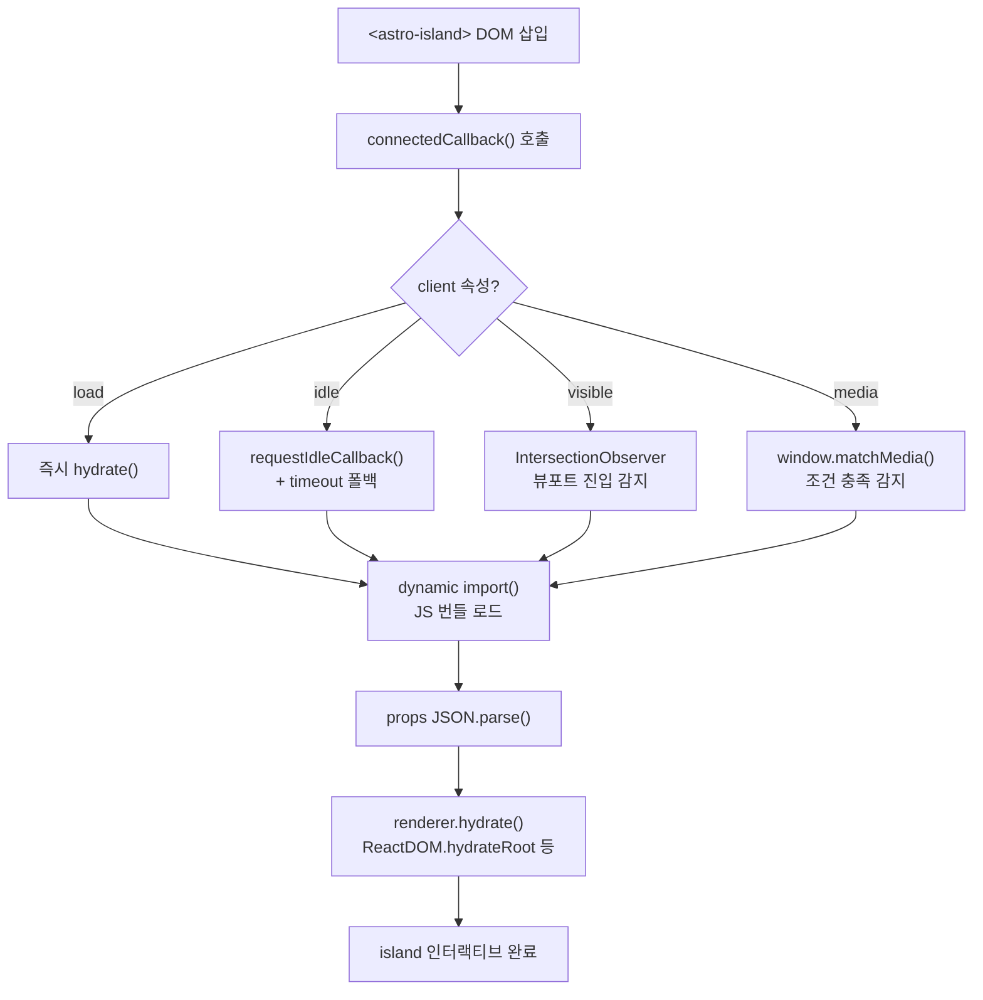
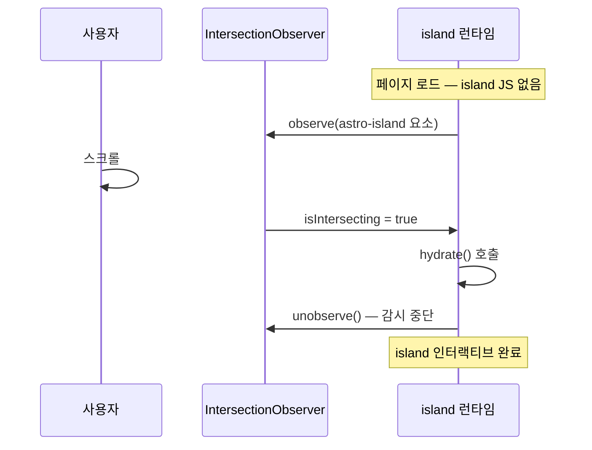
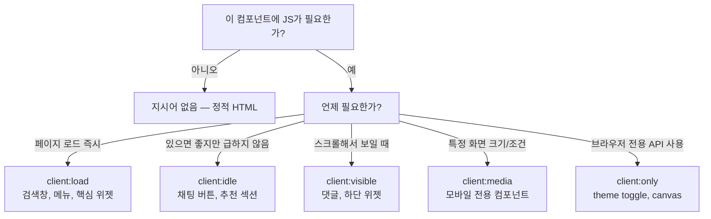

[1편](/blog/astro-islands-architecture)에서 Astro가 `<astro-island>` 태그를 심고, ~1kb 런타임이 Custom Element API로 그 태그를 감지한다는 흐름을 정리했다.

이번 글에서는 그 안으로 더 들어간다. `client:load`, `client:idle`, `client:visible`, `client:media`가 각각 어떤 브라우저 API를 사용하는지, 실제 코드 수준에서 파헤친다.

---

## 전체 구조 먼저

`<astro-island>`는 [Custom Elements API](https://developer.mozilla.org/en-US/docs/Web/API/Web_components/Using_custom_elements)로 정의된 HTML 태그다. 브라우저가 이 태그를 DOM에 삽입하는 순간 `connectedCallback`이 발화하고, 여기서 `client` 속성을 읽어 전략을 분기한다.



모든 전략의 끝은 동일하다. 차이는 **"언제 `hydrate()`를 호출하느냐"** 뿐이다.

---

## hydrate() — 공통 실행부

전략마다 타이밍이 달라도, 실행되는 `hydrate()`는 동일하다.

```js
async hydrate() {
  // 이미 hydrate됐으면 건너뜀 (중복 방지)
  if (this.hasAttribute('ssr')) return;

  const componentUrl = this.getAttribute('component-url');
  const rendererUrl  = this.getAttribute('renderer-url');

  // JS 번들을 동적으로 로드 — 캐시되면 즉시 resolve
  const [{ default: Component }, { default: renderer }] = await Promise.all([
    import(componentUrl),   // 예: /_astro/SearchBar.js
    import(rendererUrl),    // 예: /_astro/client.react.js
  ]);

  // HTML에 박힌 props를 꺼냄
  const props = JSON.parse(this.getAttribute('props') ?? '{}');
  const slots = JSON.parse(this.getAttribute('slots') ?? '{}');

  // 실제 프레임워크의 hydrate 호출
  await renderer.hydrate(Component, props, slots, this);

  // 완료 마킹 — 재실행 방지
  this.removeAttribute('ssr');
}
```

`renderer.hydrate()`가 React라면 내부적으로 이렇게 된다.

```js
// packages/renderer-react/client.js
export async function hydrate(Component, props, slots, el) {
  const { hydrateRoot, createElement } = await import("react-dom/client");

  const root = hydrateRoot(el, createElement(Component, props));

  // island가 DOM에서 제거될 때 React root도 정리
  el._root = root;
}
```

`createRoot().render()`가 아니라 `hydrateRoot()`를 쓰는 게 핵심이다.

|              | `createRoot().render()`    | `hydrateRoot()`     |
| ------------ | -------------------------- | ------------------- |
| DOM 처리     | 기존 DOM 삭제 후 새로 생성 | 기존 SSR DOM 재사용 |
| Layout Shift | 발생                       | 없음                |
| 속도         | 느림                       | 빠름 (diff만)       |
| 용도         | CSR                        | SSR 후 hydrate      |

SSR로 미리 그려진 HTML이 있기 때문에, hydrate 전에도 콘텐츠가 보인다. hydrate는 그 DOM 위에 React를 "붙이는" 것이다.

---

## client:load — connectedCallback 즉시 실행

가장 단순한 전략이다.

```js
async connectedCallback() {
  const strategy = this.getAttribute('client');

  if (strategy === 'load') {
    await this.hydrate(); // 아무 조건 없이 바로
    return;
  }
  // ...
}
```

중요한 것은 **"즉시"가 정확히 언제인가**다. HTML 파서가 `<astro-island>` 태그를 DOM에 삽입하는 순간 `connectedCallback`이 호출된다. `DOMContentLoaded`나 `window.onload`를 기다리지 않는다.

```mermaid
sequenceDiagram
  participant P as HTML 파서
  participant D as DOM
  participant R as island 런타임

  P->>D: &lt;astro-island&gt; 태그 삽입
  D->>R: connectedCallback() 즉시 호출
  R->>R: strategy === 'load'
  R->>R: dynamic import() 시작
  Note over R: 네트워크 요청 → 번들 도착 → hydrate
```

island가 여러 개라면 각각이 독립적인 Promise 체인으로 동작한다. 무거운 island가 가벼운 island를 블로킹하지 않는다.

```
island A (8kb)   ──fetch──▶ ~80ms  → hydrate
island B (42kb)  ──fetch──────────▶ ~300ms → hydrate
island C (2kb)   ──fetch─▶ ~40ms → hydrate

완료 순서: C → A → B  (서로 무관)
```

---

## client:idle — requestIdleCallback

### 브라우저 메인 스레드의 구조

`client:idle`을 이해하려면 먼저 브라우저 메인 스레드가 어떻게 동작하는지 알아야 한다.

브라우저는 JS 실행 → Style → Layout → Paint를 한 프레임(16.7ms, 60fps 기준)에 처리한다. 이 작업들이 끝나고 **남은 시간**이 idle time이다.

```mermaid
gantt
  title 브라우저 프레임 (16.7ms)
  dateFormat X
  axisFormat %Lms

  section 프레임 1
  JS 실행     :0, 6
  Style       :6, 3
  Layout      :9, 3
  Paint       :12, 2
  Idle time   :crit, 14, 3

  section 프레임 2
  JS 실행     :17, 4
  Style       :21, 2
  Layout      :23, 2
  Paint       :25, 2
  Idle time   :crit, 27, 7
```



[`requestIdleCallback`](https://developer.mozilla.org/en-US/docs/Web/API/Window/requestIdleCallback)은 이 idle time에만 실행된다. 사용자 인터랙션, 애니메이션, 렌더링을 절대 방해하지 않는다.

### 구현

```js
if (strategy === "idle") {
  if ("requestIdleCallback" in window) {
    requestIdleCallback(
      () => this.hydrate(),
      { timeout: 200 }, // 최대 200ms 안에는 강제 실행
    );
  } else {
    // Safari 등 미지원 브라우저 폴백
    setTimeout(() => this.hydrate(), 200);
  }
  return;
}
```

### deadline 객체

`requestIdleCallback`의 콜백은 `deadline` 객체를 받는다.

```js
requestIdleCallback((deadline) => {
  console.log(deadline.timeRemaining()); // 이번 idle 구간에 남은 시간 (ms)
  console.log(deadline.didTimeout); // timeout으로 강제 실행됐는지 여부
});
```

Astro는 `deadline`을 직접 활용하지 않는다. island 하나를 hydrate하는 작업이 수십ms 이내라서 굳이 쪼갤 필요가 없기 때문이다. 그냥 idle time에 `hydrate()`를 통째로 실행한다.

### timeout: 200의 역할

`timeout` 없이 쓰면 브라우저가 바쁠 때 무기한 지연될 수 있다.

```
사용자가 페이지 로드 직후 스크롤을 계속 내린다면?

timeout 없음:
  requestIdleCallback 등록
  → 스크롤 이벤트 처리 (idle time 없음)
  → 스크롤 이벤트 처리 (idle time 없음)
  → ... 몇 초가 지나도 hydrate 안 됨 ← 문제

timeout: 200 설정:
  requestIdleCallback 등록
  → 스크롤 이벤트 처리
  → 200ms 경과 → deadline.didTimeout = true → 강제 실행
```

`didTimeout`이 `true`면 idle time이 아닌 상황에서 강제 실행된 것이다. 이때 `timeRemaining()`은 `0`을 반환한다.

### Safari 폴백

Safari는 아직 `requestIdleCallback`을 [지원하지 않는다](https://caniuse.com/requestidlecallback). Astro는 `setTimeout(fn, 200)`으로 폴백한다. 진짜 idle time을 감지하는 건 아니지만, 초기 렌더링이 200ms 안에 대부분 끝나기 때문에 실제로는 비슷한 효과를 낸다.

---

## client:visible — IntersectionObserver

뷰포트에 island가 진입할 때 hydrate한다. 스크롤해서 보일 때까지 JS를 전혀 로드하지 않는다.

```js
if (strategy === "visible") {
  const observer = new IntersectionObserver((entries) => {
    if (entries[0].isIntersecting) {
      this.hydrate();
      observer.unobserve(this); // 1회만 실행, 이후 감시 중단
    }
  });
  observer.observe(this);
  return;
}
```

[`IntersectionObserver`](https://developer.mozilla.org/en-US/docs/Web/API/Intersection_Observer_API)는 특정 요소가 뷰포트와 교차하는지를 비동기로 감지하는 API다. 스크롤 이벤트를 직접 리스닝하는 것보다 훨씬 성능이 좋다.



`observer.unobserve(this)`가 중요하다. 한 번 hydrate되고 나면 더 이상 감시할 필요가 없다. 스크롤할 때마다 `hydrate()`가 재실행되는 걸 방지한다.

---

## client:media — matchMedia

특정 미디어 쿼리 조건이 충족될 때 hydrate한다. 모바일에서만 쓰는 컴포넌트 등에 유용하다.

```js
if (strategy === "media") {
  const query = this.getAttribute("client-media");
  const mq = window.matchMedia(query);

  const handler = () => {
    if (mq.matches) {
      this.hydrate();
      mq.removeEventListener("change", handler); // 1회만
    }
  };

  mq.addEventListener("change", handler);

  // 이미 조건이 충족된 상태라면 즉시 실행
  if (mq.matches) {
    this.hydrate();
  }
  return;
}
```

```astro
<!-- 768px 이상일 때만 hydrate -->
<DesktopMenu client:media="(min-width: 768px)" />

<!-- 다크모드일 때만 hydrate -->
<DarkModeWidget client:media="(prefers-color-scheme: dark)" />
```

---

## client:only — SSR을 건너뛴다

`client:only`는 다른 전략과 달리 **SSR 자체를 하지 않는다**. 서버에서 렌더링 불가능한 컴포넌트(예: `window` 직접 참조, 브라우저 전용 API 사용)에 쓴다.

```js
// client:only는 서버에서 아예 실행되지 않음
// HTML에 placeholder HTML이 없음 — 완전히 빈 상태에서 시작
if (strategy === "only") {
  await this.hydrate(); // client:load와 동일하게 즉시 실행
  return;
}
```

```astro
<!-- window.localStorage를 쓰는 컴포넌트 — SSR하면 에러 -->
<ThemeToggle client:only="react" />
```

`hydrateRoot` 대신 `createRoot().render()`를 사용한다. SSR HTML이 없으니 "붙일" DOM이 없기 때문이다.

---

## await-children — 부모/자식 island 순서 보장

부모-자식 관계의 island가 있을 때 문제가 생길 수 있다. 부모가 먼저 hydrate되면서 자식 DOM을 덮어쓰면 자식 island가 날아갈 수 있다.

Astro는 `await-children` 속성으로 이를 해결한다.

```html
<astro-island client="load" await-children="">
  <div>
    <astro-island client="load" component-url="/Child.js"> ... </astro-island>
  </div>
</astro-island>
```

```js
async hydrate() {
  if (this.hasAttribute('await-children')) {
    // 내부의 모든 astro-island가 완료될 때까지 대기
    const innerIslands = this.querySelectorAll('astro-island');
    await Promise.all(
      [...innerIslands].map(island => island.hydrated)
      // island.hydrated는 각 island가 hydrate 완료 시 resolve하는 Promise
    );
  }
  await this.doHydrate();
}
```

---

## island 간 통신 — 격리의 트레이드오프

선택적 hydration의 트레이드오프는 **island들이 서로 격리된다**는 점이다. React의 Context나 상태가 트리를 타고 내려가는 구조가 불가능하다.

```
island A (SearchBar)  ──┐
                         ├── 서로 React 상태 공유 불가
island B (CartIcon)   ──┘
```

Astro는 이를 위해 [nanostores](https://github.com/nanostores/nanostores) 같은 프레임워크 무관 스토어를 공식 권장한다.

```js
// store.js — 프레임워크 무관
import { atom } from "nanostores";
export const cartCount = atom(0);

// SearchBar.tsx (island A)
import { cartCount } from "./store";
cartCount.set(cartCount.get() + 1);

// CartIcon.tsx (island B) — 완전히 다른 island지만 같은 store 구독
import { useStore } from "@nanostores/react";
import { cartCount } from "./store";
const count = useStore(cartCount); // 반응형으로 업데이트
```

island들이 React 트리 밖에서 공유 상태를 구독하는 방식이다. 어떤 UI 프레임워크를 쓰든 동작한다.

---

## 전략 선택 기준



---

## 정리

선택적 Hydration은 특별한 마법이 아니다. 브라우저의 네이티브 API들을 조합해서 "언제 JS를 실행할지"를 제어하는 것이다.

| 전략             | 브라우저 API                              | 특징                |
| ---------------- | ----------------------------------------- | ------------------- |
| `client:load`    | Custom Element `connectedCallback`        | DOM 삽입 즉시       |
| `client:idle`    | `requestIdleCallback` + `setTimeout` 폴백 | 메인 스레드 여유 시 |
| `client:visible` | `IntersectionObserver`                    | 뷰포트 진입 시, 1회 |
| `client:media`   | `window.matchMedia`                       | 조건 충족 시        |
| `client:only`    | `connectedCallback` (SSR 없음)            | 브라우저 전용       |

그리고 모든 전략의 끝에는 동일한 `hydrate()` — `dynamic import()` → `JSON.parse(props)` → `hydrateRoot()` — 가 있다.

다음 글에서는 Next.js RSC의 Selective Hydration, Qwik의 Resumability 등 다른 프레임워크들이 hydration 문제를 어떻게 다르게 풀었는지 비교한다.

---

## 참고 자료

- [Astro 공식 문서 — Client Directives](https://docs.astro.build/en/reference/directives-reference/#client-directives)
- [Astro GitHub — island 런타임 소스](https://github.com/withastro/astro/blob/main/packages/astro/src/runtime/client/visible.ts)
- [MDN — Custom Elements](https://developer.mozilla.org/en-US/docs/Web/API/Web_components/Using_custom_elements)
- [MDN — requestIdleCallback](https://developer.mozilla.org/en-US/docs/Web/API/Window/requestIdleCallback)
- [MDN — IntersectionObserver](https://developer.mozilla.org/en-US/docs/Web/API/Intersection_Observer_API)
- [MDN — matchMedia](https://developer.mozilla.org/en-US/docs/Web/API/Window/matchMedia)
- [Can I use — requestIdleCallback](https://caniuse.com/requestidlecallback)
- [nanostores — 프레임워크 무관 상태 관리](https://github.com/nanostores/nanostores)
- [React 공식 문서 — hydrateRoot](https://react.dev/reference/react-dom/client/hydrateRoot)
