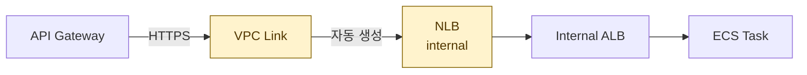
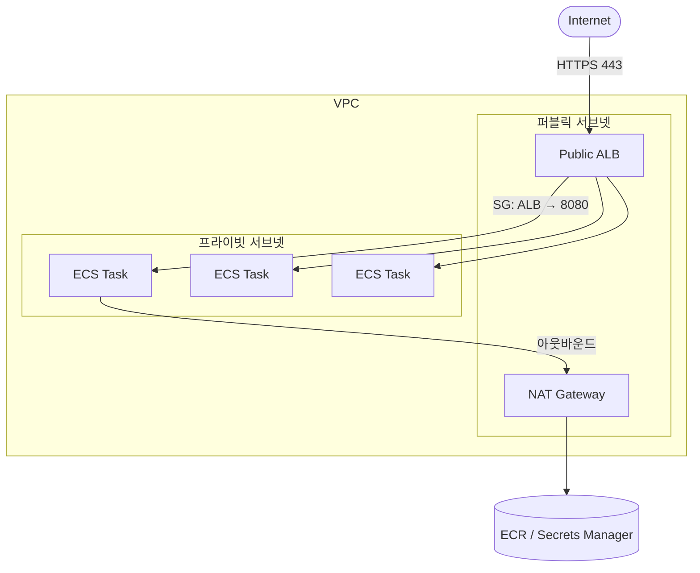
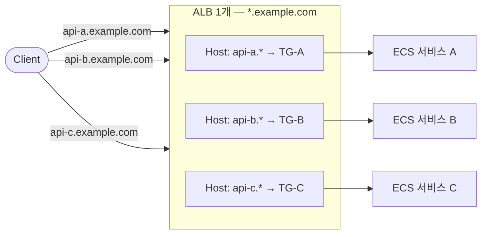
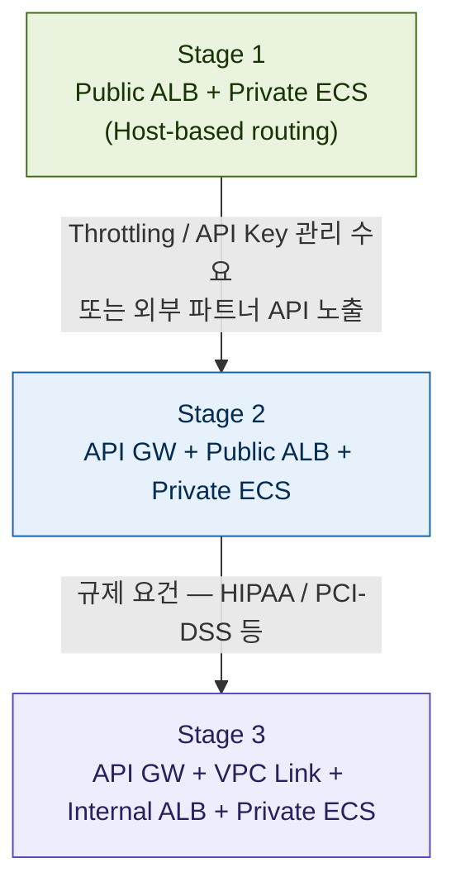

AWS에서 ECS 기반 백엔드를 구성할 때 흔히 마주치는 스택이 있다.

```
API Gateway → VPC Link → Internal ALB → Private ECS
```

교과서적으로 보면 합리적인 구성이다. 하지만 실제로 운영하다 보면 "이게 다 필요한가?" 하는 의문이 생긴다. 이 글에서는 각 레이어의 역할을 짚고, 언제 단순화할 수 있는지, 그리고 더 나은 대안은 무엇인지, 마지막으로 이런 과설계가 왜 일어나는지까지 정리한다.

## 각 레이어가 하는 일

### API Gateway

퍼블릭 엔드포인트 역할을 하면서 인증(JWT, API Key), throttling, 라우팅을 처리한다. 멀티 서비스 앞단에 단일 진입점을 두고 싶을 때 유용하다.

### VPC Link

API Gateway(퍼블릭)에서 VPC 내부 리소스로 연결하는 브릿지다. 내부적으로 **NLB를 자동 생성**하기 때문에, 실질적인 스택은 이렇게 된다.



> VPC Link 하나를 추가하는 것처럼 보이지만, 실제로는 NLB가 내부에 생성되어 2홉 구조가 된다. 레이턴시와 비용이 모두 올라간다.

### Internal ALB

L7 로드밸런싱, path-based routing, health check를 담당한다. ECS 서비스가 여러 개일 때 path로 분기하거나, 세밀한 health check가 필요할 때 여전히 의미 있다.

### Private ECS

컨테이너 태스크가 프라이빗 서브넷에서 실행된다. 인터넷에서 직접 접근 불가능하다.

---

## Public ALB + Private ECS로 충분한가?

결론부터 말하면 **대부분의 서비스에서 충분하다.**

ALB는 퍼블릭 서브넷, ECS는 프라이빗 서브넷에 두면 된다. 핵심은 **Security Group 설정**이다.

```
ALB SG:  inbound  0.0.0.0/0  → 443
ECS SG:  inbound  ALB SG ID  → 서비스 포트 (예: 8080)
ECS SG:  outbound 0.0.0.0/0  → 허용 (NAT 경유)
```

ECS SG의 inbound를 ALB SG ID로 지정하면 ALB를 통하지 않은 직접 접근은 전부 차단된다. IP 노출 없이 격리 효과를 낼 수 있다.



### 아웃바운드 처리

ECS가 ECR에서 이미지를 pull하거나 외부 API를 호출하려면 NAT Gateway가 필요하다. NAT Gateway는 퍼블릭 서브넷에 위치해야 한다.

비용을 줄이고 싶다면 ECR, Secrets Manager 등에 **VPC Endpoint**를 붙이는 방법도 있다. NAT 트래픽 자체를 줄일 수 있어 장기적으로 유리하다.

---

## 진짜 문제는 따로 있었다 — ALB 증식

이 구조에 API Gateway를 도입했던 원래 이유가 있다. **서비스마다 ALB를 1개씩 붙이던 구조** 때문이었다.

```
서비스 A → ALB-A (443) → ACM 인증서 A → Route53 A
서비스 B → ALB-B (443) → ACM 인증서 B → Route53 B
서비스 C → ALB-C (443) → ACM 인증서 C → Route53 C
```

서비스가 늘어날 때마다 ALB가 선형으로 증가했고, ALB는 월 $16~20의 고정 비용이 발생한다. 이 문제를 해결하려고 API Gateway를 앞단에 두면 ALB 개수를 줄일 수 있겠다는 판단이 있었다.

그 판단 자체는 틀리지 않았다. 다만 더 직접적인 해결책이 있었다.

---

## 더 나은 해결책 — Host-based routing

ALB는 단일 인스턴스로 **여러 도메인의 트래픽을 분기**할 수 있다. Listener Rule의 Host Header 조건을 활용하는 방식이다.

### 동작 원리

HTTP 요청에는 항상 `Host` 헤더가 포함된다.

```
GET /search HTTP/1.1
Host: api-a.example.com   ← ALB가 이 값을 읽는다
```

ALB Listener Rule이 이 값을 조건으로 Target Group을 분기한다. 클라이언트 입장에서는 평소처럼 도메인에 요청을 보내는 것뿐이고, 라우팅은 ALB 내부에서 투명하게 일어난다.

### 구성 방법

**1. ACM Wildcard 인증서 1장 발급**

```
*.example.com
```

`api-a.example.com`, `api-b.example.com` 모두 이 인증서 하나로 커버된다.

**2. ALB Listener Rule 설정**

```
규칙 1: Host header = api-a.example.com  →  Forward to TG-A
규칙 2: Host header = api-b.example.com  →  Forward to TG-B
규칙 3: Host header = api-c.example.com  →  Forward to TG-C
규칙 기본: 404 반환
```

**3. Route53**

```
api-a.example.com  →  Alias → ALB DNS
api-b.example.com  →  Alias → ALB DNS  (같은 ALB)
api-c.example.com  →  Alias → ALB DNS  (같은 ALB)
```

서브도메인이 달라도 ALB는 하나다. Route53이 각 서브도메인을 동일한 ALB로 보내고, ALB가 Host 헤더로 분기한다.



### 기존 구조 대비 효과

|                  | 서비스당 ALB         | Host-based routing     |
| ---------------- | -------------------- | ---------------------- |
| ALB 수           | 서비스 N개 = ALB N개 | 항상 1개               |
| ACM 인증서       | 서비스마다 발급      | Wildcard 1장           |
| 신규 서비스 추가 | ALB 신규 생성        | Listener Rule 1줄 추가 |
| 월 고정비        | $16 × N              | $16                    |

ALB 1개로 Listener Rule을 100개까지 추가할 수 있어 서비스가 수십 개 늘어나도 ALB는 그대로 1개다.

---

## Host-based routing 도입 시 고려사항

구조는 단순하지만 미리 알아두어야 할 몇 가지가 있다.

### ALB 단일 장애점

ALB 1개로 통합하면 그 ALB에 장애가 생겼을 때 전체 서비스가 동시에 영향을 받는다. 다만 AWS ALB는 Multi-AZ로 이중화되어 있어 실질적인 장애 위험은 낮다. 현실적인 운영 리스크는 오히려 **Listener Rule을 잘못 수정해 라우팅이 깨지는 경우**다. Rule 변경을 Terraform 같은 IaC로 관리하고 코드 리뷰를 거치도록 하면 충분히 완화된다.

### 서비스 간 트래픽 격리

기존 ALB-per-service 구조에서는 특정 서비스의 트래픽 폭증이 다른 서비스에 영향을 줄 수 없었다. 통합 구조에서는 ALB 레벨에서 connection 수와 대역폭을 공유하게 된다. 특정 서비스가 비정상적인 트래픽을 받을 가능성이 있다면 **WAF를 ALB 앞에 붙이고 서비스별 Rate Limiting Rule**을 추가하는 것이 현실적인 대응이다.

### Wildcard 인증서 범위

`*.example.com`은 서브도메인 1단계만 커버한다.

```
✅ api-a.example.com
❌ v2.api-a.example.com  ← 커버 안 됨
```

나중에 버전별 또는 환경별 도메인이 생기면 Wildcard 1장으로 커버되지 않을 수 있다. 도메인 네이밍 규칙을 미리 단층 구조로 잡아두는 것이 중요하다.

```
권장: api-a.example.com, api-a-staging.example.com
회피: v2.api-a.example.com, staging.api-a.example.com
```

---

## 단계별 아키텍처 진화

아키텍처는 처음부터 완성형일 필요 없다. 실제 요건이 생길 때 단계적으로 올리는 게 낫다.



|                 | Stage 1          | Stage 2          | Stage 3            |
| --------------- | ---------------- | ---------------- | ------------------ |
| 비용            | ALB만            | ALB + API GW     | ALB + API GW + NLB |
| 보안 격리       | SG 기반          | SG 기반 + WAF    | 네트워크 완전 격리 |
| 인증/throttling | 앱 레벨          | API GW 기본 제공 | API GW 기본 제공   |
| 관리 복잡도     | 낮음             | 중간             | 높음               |
| 적합한 상황     | 초기~중기 서비스 | 외부 API 노출    | 규제 산업          |

---

## 이 과정에서 배운 것 — 아키텍처 의사결정

기술적인 결론 못지않게 중요한 것은 **왜 이런 과설계가 일어났는가**다.

### 솔루션이 먼저 떠오를 때의 함정

당시 의사결정 흐름을 재구성하면 이랬다.

```
문제: ALB가 너무 많아진다
→ "API Gateway를 쓰면 줄일 수 있지 않을까?"
→ API Gateway 도입 결정
→ VPC Link 필요 → NLB 생성 → 구조 복잡화
```

API Gateway는 "API 관리 도구"인데 "ALB 개수 절감 도구"로 사용된 셈이다. 도구의 본래 목적과 사용 목적이 어긋나면 그 도구가 원래 필요로 하는 것들이 side effect로 딸려온다. 이 경우에는 VPC Link와 NLB가 그 side effect였다.

### 두 가지 체크 습관

결정 전에 이 두 가지를 묻는 것만으로도 대부분의 과설계를 걸러낼 수 있다.

**1. "이 도구가 이 문제를 풀기 위해 만들어진 도구인가?"**

API Gateway의 존재 이유는 throttling, 인증 중앙화, API 버전 관리다. ALB 절감이 아니다. 목적이 어긋난다면 side effect가 따라온다는 신호다.

**2. "이 문제를 더 직접적으로 푸는 방법은 없는가?"**

ALB 개수 문제 → ALB 자체 기능(Listener Rule)으로 해결 가능한지 먼저 확인했다면 Host-based routing에 도달했을 것이다. 새 도구를 찾기 전에 현재 도구의 기능 범위를 먼저 탐색하는 것이 순서다.

### 비용 구조를 도입 전에 계산하기

AWS에서 레이어를 추가할 때마다 고정비와 변동비 구조가 달라진다. 이를 도입 전에 한 번이라도 계산해보면 "이게 정말 절약인가?"가 바로 보인다.

```
기존: ALB 3개 = $16 × 3 = $48/월

API GW 도입 후 (트래픽 1,000만 건/월 기준):
  ALB 1개:         $16
  NLB (VPC Link):  $16
  API GW 요청 과금: $35   ← 100만 건당 $3.50
  합계:            $67/월  → 기존보다 비쌈
```

숫자로 놓고 보면 도입 전에 이미 답이 보였을 것이다.

### 한 줄 원칙

> 솔루션이 먼저 떠올랐다면, 그 솔루션이 없었을 때 같은 문제를 어떻게 풀었을지를 한 번 더 생각해라.

이 질문 하나가 "API Gateway 없이 ALB 개수 문제를 풀 수 있는가?"로 이어지고, Host-based routing에 자연스럽게 도달하게 해준다.

---

## 정리

- **ECS가 프라이빗 서브넷에 있어도** ALB를 통한 접근은 정상 동작한다. ALB는 퍼블릭, ECS는 프라이빗 서브넷에 두고 SG로 격리하면 된다.
- **ALB 증식 문제는 Host-based routing으로** 해결할 수 있다. Wildcard 인증서 1장 + Listener Rule 분기 구조로 ALB 1개에 수십 개 서비스를 통합할 수 있다.
- **VPC Link는 규제 요건이 있을 때만** 정당화된다. 그 전에는 비용과 복잡도만 올린다.
- **API Gateway는 API 관리 수요가 생겼을 때** 붙이면 된다. ALB 절감 수단으로 쓰는 것은 목적이 어긋난다.
- 새 도구를 찾기 전에, **지금 쓰는 도구가 이미 그 문제를 풀 수 있는지** 먼저 확인하는 습관이 과설계를 막는다.
