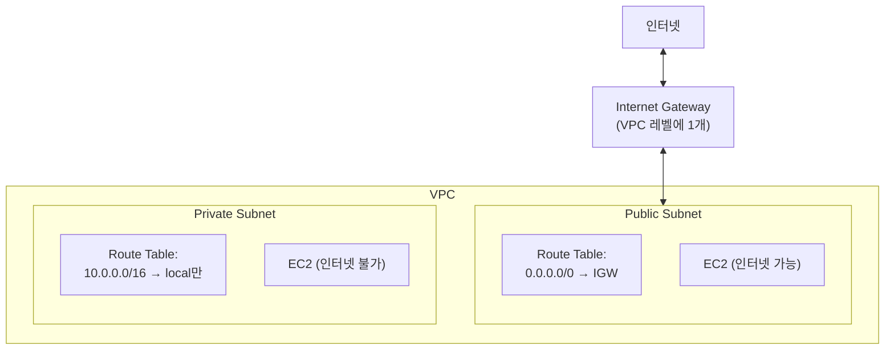
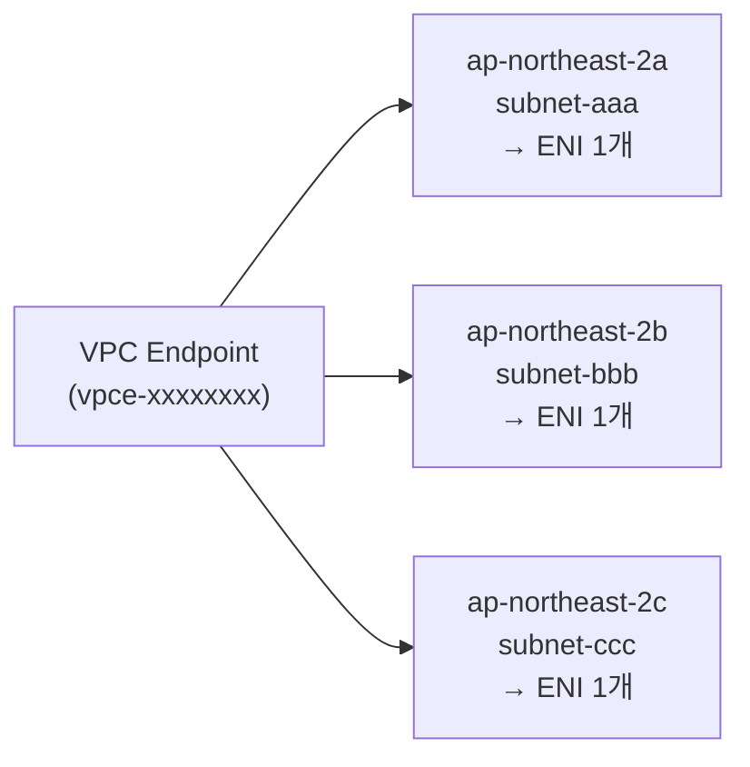

MongoDB Atlas Private Endpoint를 설정하다가 AWS 네트워크 개념이 머릿속에서 뒤섞였다. VPC가 뭔지는 알겠는데 서브넷이랑 AZ의 관계, IGW가 어디에 붙는 건지, Interface Endpoint는 어느 서브넷에 있어야 하는 건지 — 이 글은 그 과정에서 정리한 개념들이다.

## VPC란

VPC(Virtual Private Cloud)는 AWS 내에서 논리적으로 격리된 네트워크 공간이다. 하나의 VPC는 하나의 IP 대역을 가진다 (예: `10.0.0.0/16`).

서울 리전 기준으로 AWS는 계정 생성 시 Default VPC를 자동으로 만들어준다. Default VPC의 CIDR은 `172.31.0.0/16`이다.

## 서브넷이란

서브넷은 VPC의 IP 대역을 잘게 쪼갠 것이다. `10.0.0.0/16` VPC를 `10.0.1.0/24`, `10.0.2.0/24` 처럼 나누는 식이다.

중요한 점은 **서브넷은 IP 범위를 논리적으로 분할한 것일 뿐, 대역폭을 물리적으로 쪼개는 개념이 아니다.** 네트워크 대역폭은 EC2 인스턴스 타입에 귀속된다. 같은 VPC 안에 있으면 서브넷이 달라도 별도 설정 없이 통신된다.

### Public Subnet vs Private Subnet

흔히 Public/Private Subnet이라고 부르지만, AWS가 공식적으로 구분하는 타입이 아니다. 관행적인 명칭이고, 실제 차이는 딱 하나다.

|               | Public Subnet          | Private Subnet         |
| ------------- | ---------------------- | ---------------------- |
| 라우팅 테이블 | `0.0.0.0/0 → IGW` 있음 | `0.0.0.0/0 → IGW` 없음 |
| 인터넷 통신   | 가능                   | 불가 (NAT 없으면)      |
| VPC 내부 통신 | **가능**               | **가능**               |

**VPC 내부 통신은 Public/Private 구분과 무관하다.** 같은 VPC 안이면 어느 서브넷이든 `local` 라우팅 룰로 통신된다.

## AZ와 서브넷의 관계

서브넷은 반드시 하나의 가용영역(AZ)에 속한다. 서브넷 생성 시 AZ를 지정하면 이후 변경이 불가능하다. 반대로 하나의 AZ에는 서브넷이 여러 개 있을 수 있다.

```
VPC (서울 리전)
├── ap-northeast-2a
│   ├── Public Subnet  10.0.1.0/24
│   ├── Private Subnet 10.0.2.0/24
│   └── Private Subnet 10.0.3.0/24
├── ap-northeast-2b
│   ├── Public Subnet  10.0.4.0/24
│   └── Private Subnet 10.0.5.0/24
└── ap-northeast-2c
    ├── Public Subnet  10.0.6.0/24
    └── Private Subnet 10.0.7.0/24
```

AZ가 다른 서브넷끼리도 같은 VPC면 통신된다. 단, AZ 간 트래픽은 소량의 데이터 전송 요금이 발생한다 (같은 AZ는 무료).

### 왜 AZ마다 서브넷을 나누나

AZ는 물리적으로 분리된 데이터센터다. 고가용성(HA) 구성을 위해 AZ별로 서브넷을 두고 리소스를 분산하면, 한 AZ가 장애나도 다른 AZ의 인스턴스가 살아남는다.

## IGW는 VPC 레벨에 붙는다

Internet Gateway(IGW)는 서브넷이 아니라 **VPC 레벨**에 붙는다. VPC 하나에 IGW 하나가 연결된다.

서브넷이 Public이냐 Private이냐는 라우팅 테이블에 `0.0.0.0/0 → IGW` 룰이 있느냐 없느냐의 차이다. 같은 VPC의 IGW를 여러 Public Subnet이 공유해서 쓴다.



## Interface Endpoint (ENI)

Interface Endpoint는 AWS PrivateLink 기반으로 외부 서비스에 private하게 연결할 때 사용한다. 생성하면 지정한 서브넷 안에 ENI(Elastic Network Interface)가 하나 만들어진다.

### 서브넷당 1개

하나의 Endpoint는 같은 서브넷에 ENI를 1개만 만들 수 있다. 하지만 여러 AZ의 서브넷을 동시에 지정하면 AZ별로 ENI가 각각 생긴다.



### 하나의 서브넷에 여러 Endpoint ENI가 공존 가능

서브넷 하나에 여러 Interface Endpoint의 ENI를 함께 넣을 수 있다. 그래서 실무에서는 "Endpoint 전용 서브넷"을 AZ별로 하나씩 만들어두고, PrivateLink 서비스가 늘어날수록 ENI를 같은 서브넷에 추가하는 패턴을 많이 쓴다.

```
Private Subnet (Endpoint 전용)
├── ENI: MongoDB Atlas
├── ENI: S3 Interface Endpoint
├── ENI: Secrets Manager
└── ENI: ECR
```

### Public Subnet에 Endpoint를 둬도 된다

Endpoint ENI가 꼭 Private Subnet에 있어야 할 필요는 없다. Public Subnet에 생성해도 기능적으로 완전히 동작한다. Private Subnet 권장은 보안 관행의 문제다.

## 정리

- 서브넷 = VPC IP 범위의 논리적 분할, 대역폭과 무관
- Public/Private 구분은 IGW 라우팅 유무일 뿐, VPC 내부 통신은 항상 가능
- 서브넷은 AZ에 1:1 귀속, AZ가 달라도 같은 VPC면 통신됨
- IGW는 VPC 레벨에 1개, 서브넷은 라우팅 테이블로 사용 여부 결정
- Interface Endpoint는 서브넷당 ENI 1개, 여러 Endpoint가 같은 서브넷에 공존 가능

다음 편에서는 이 개념을 바탕으로 실제 MongoDB Atlas Private Endpoint를 연결하고 트러블슈팅한 과정을 다룬다.

import LinkCard from "@/components/mdx/LinkCard";

<LinkCard
  href="/blog/mongodb-atlas-private-endpoint-aws"
  title="MongoDB Atlas Private Endpoint 연결 가이드 — AWS PrivateLink 삽질기"
  description="DNS 동작 방식, Security Group 설정, 포트 범위의 이유까지 — 실제 삽질을 통해 정리한 트러블슈팅 가이드."
/>
