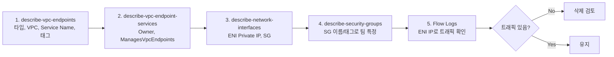

## VPC Flow Logs란?

VPC 안에서 오가는 모든 네트워크 트래픽을 기록하는 AWS 기능이다.
아래와 같은 형식으로 **누가(src-ip) 어디로(dst-ip) 어떤 포트로 얼마나 통신했는지** 전부 남긴다.

```
version  account     eni       src-ip      dst-ip        src-port  dst-port  protocol  bytes  action
2        <account-id> eni-xxx  10.0.1.10   10.0.2.100    54231     27017     6         1234   ACCEPT
```

기본적으로 비활성화 상태라 따로 켜줘야 한다.

---

## 왜 켜야 하는가?

- Interface VPC Endpoint가 실제로 쓰이는지 확인할 때
- 장애 디버깅, 보안 감사 시 트래픽 추적
- "이 Endpoint 누가 만들었고 누가 쓰는지" 역추적

Flow Logs 없이는 트래픽 확인 방법이 사실상 없다.

---

## 비용

| 저장 위치       | 비용                             |
| --------------- | -------------------------------- |
| CloudWatch Logs | 수집 비용 + 스토리지 비용 (비쌈) |
| S3              | S3 스토리지 비용만 (훨씬 저렴)   |

트래픽이 많은 VPC면 로그 용량이 빠르게 쌓이므로 **S3 + 수명주기 정책** 조합을 권장한다.
네트워크 성능에는 영향 없다.

---

## 활성화 방법

### 1. S3 버킷 생성

```bash
aws s3 mb s3://<your-bucket-name>
```

### 2. Flow Log 활성화

```bash
aws ec2 create-flow-logs \
  --resource-type VPC \
  --resource-ids <vpc-id> \
  --traffic-type ALL \
  --log-destination-type s3 \
  --log-destination arn:aws:s3:::<your-bucket-name> \
  --max-aggregation-interval 60
```

| 옵션                            | 설명                               |
| ------------------------------- | ---------------------------------- |
| `--traffic-type ALL`            | ACCEPT + REJECT 둘 다 기록         |
| `--max-aggregation-interval 60` | 1분 단위 집계 (기본 10분보다 정확) |
| `--log-destination-type s3`     | S3에 저장                          |

### 3. S3 수명주기 정책 (90일 후 자동 삭제)

```bash
aws s3api put-bucket-lifecycle-configuration \
  --bucket <your-bucket-name> \
  --lifecycle-configuration '{
    "Rules": [{
      "ID": "delete-old-flowlogs",
      "Status": "Enabled",
      "Filter": {"Prefix": ""},
      "Expiration": {"Days": 90}
    }]
  }'
```

---

## 활성화 확인

```bash
aws ec2 describe-flow-logs \
  --filter Name=resource-id,Values=<vpc-id>
```

`FlowLogs` 배열에 항목이 있으면 정상 활성화된 것이다.

---

## Endpoint 트래픽 확인

활성화 후 **15~30분** 뒤부터 로그가 쌓이기 시작한다.

### S3에 로그 쌓이는지 확인

```bash
aws s3 ls s3://<your-bucket-name>/ --recursive | head -20
```

### 특정 ENI IP로 트래픽 조회 (CloudWatch 사용 시)

Interface Endpoint ENI의 Private IP를 먼저 확인한다.

```bash
aws ec2 describe-network-interfaces \
  --network-interface-ids <eni-id> \
  --query 'NetworkInterfaces[0].PrivateIpAddress'
```

CloudWatch Logs에 저장했다면 해당 IP로 필터링:

```bash
aws logs filter-log-events \
  --log-group-name <flow-log-group> \
  --filter-pattern "[v,acc,eni,src,dst=<eni-private-ip>,...]" \
  --start-time $(date -d '7 days ago' +%s000)
```

### S3 저장 시 Athena로 쿼리

S3에 저장한 경우 Athena 테이블을 만들어 SQL로 조회하는 것이 편하다.
(Athena 쿼리 설정은 별도 문서 참고)

---

## 조사 대상 Endpoint 체크리스트

미확인 Endpoint를 조사할 때 아래 항목을 순서대로 확인한다.


