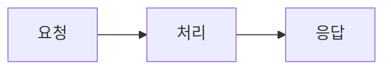

import Callout from "@/components/mdx/Callout";
import LinkCard from "@/components/mdx/LinkCard";

[2편](/blog/building-blog-with-ai-2)에서 세 가지 버그를 잡았다. 이번에는 버그 수정이 아니라 **블로그를 실제로 공유하고 사용하면서 필요해진 개선 작업**들을 다룬다. OG 이미지의 한글 깨짐, 공유 버튼 추가, 포스트 이미지 지원, Mermaid 코드 블록 자동 렌더링까지 — 네 가지 주제를 순서대로 정리한다.

## 1. OG 이미지에서 한글이 깨진다

블로그 링크를 카카오톡에 공유했더니 OG 이미지의 한글 제목이 □□□로 표시되었다. 영문은 정상이었다.

### 원인 — Google Fonts의 유니코드 서브셋

OG 이미지는 [satori](https://github.com/vercel/satori)로 생성하고, 폰트는 Google Fonts CDN에서 Inter Bold를 가져오고 있었다. 문제는 **한글 폰트가 아예 없었다**는 것이다. satori는 브라우저처럼 시스템 폰트에 폴백하지 않는다. 등록된 폰트에 해당 글리프가 없으면 그냥 깨진다.

첫 번째 시도로 Google Fonts에서 Noto Sans KR을 가져왔지만, CDN이 반환한 건 유니코드 서브셋(~300KB)이었다. 자주 쓰는 한글만 포함된 파일이라 "회고"의 "고" 같은 글자가 누락되어 여전히 깨졌다.

### 해결 — 풀 한글 폰트 로컬 번들링

fontsource에서 Noto Sans KR Bold 전체 파일(2.3MB)을 받아 `public/fonts/`에 저장했다. 빌드 타임에만 사용되므로 사용자에게 전달되는 번들 크기에는 영향이 없다.

```typescript
// src/lib/og.ts
async function loadKoreanFont(): Promise<ArrayBuffer> {
  try {
    const fontPath = join(
      process.cwd(),
      "public",
      "fonts",
      "NotoSansKR-Bold.ttf",
    );
    const buffer = await readFile(fontPath);
    return buffer.buffer as ArrayBuffer;
  } catch {
    // CDN 폴백
    const res = await fetch(
      "https://cdn.jsdelivr.net/fontsource/fonts/noto-sans-kr@latest/korean-700-normal.ttf",
    );
    return await res.arrayBuffer();
  }
}
```

satori에 두 폰트를 모두 등록하면, 한글 글리프가 없는 Inter에서 자동으로 Noto Sans KR로 폴백한다.

```typescript
fonts: [
  { name: "Inter", data: await loadFont(), weight: 700 },
  { name: "Noto Sans KR", data: await loadKoreanFont(), weight: 700 },
],
```

<Callout type="tip" title="satori의 폰트 폴백">
  satori는 `fonts` 배열의 순서대로 글리프를 탐색한다. 첫 번째 폰트에 해당
  글리프가 없으면 두 번째 폰트를 시도한다. 다국어 OG 이미지를 만들 때는 기본
  폰트 + 해당 언어 폰트를 함께 등록하면 된다.
</Callout>

### 함께 진행한 리팩토링

이 작업과 함께 OG 이미지 생성 로직도 정리했다. 기존에는 포스트별 OG 이미지 엔드포인트(`/og/[...slug].png.ts`)에 모든 로직이 들어 있었는데, 공통 유틸을 `src/lib/og.ts`로 분리하고 사이트 기본 OG 이미지(`/og-default.png`)도 추가했다. 포스트에 `coverImage`가 없으면 자동으로 텍스트 기반 OG 이미지가 생성된다.

## 2. 공유 버튼 — Web Share API와 폴백

블로그 글을 공유하려면 URL을 직접 복사해야 했다. 공유 버튼을 추가하기로 했다.

### 설계 결정

모바일에서는 OS 네이티브 공유 시트(Web Share API)를, 데스크톱에서는 X/LinkedIn/링크 복사 드롭다운을 보여주는 방식을 택했다.

```tsx
const handleShare = useCallback(async () => {
  if (navigator.share) {
    try {
      await navigator.share({ title, url });
      return;
    } catch {
      // 사용자가 취소하거나 API 에러 — 드롭다운으로 폴백
    }
  }
  setOpen((prev) => !prev);
}, [title, url]);
```

`navigator.share`가 존재하면 네이티브 공유를 시도하고, 없거나 실패하면 커스텀 드롭다운을 연다. 이 패턴은 **progressive enhancement**의 전형적인 예다 — 지원되는 환경에서는 더 나은 경험을, 그렇지 않은 환경에서도 동작하는 폴백을 제공한다.

### Astro Islands로 통합

`ShareButton`은 React 컴포넌트이므로 Astro의 Islands 아키텍처에 맞게 `client:visible`로 하이드레이션했다. 포스트 헤더에 날짜와 나란히 배치했다.

```astro
<ShareButton
  client:visible
  url={Astro.url.href}
  title={title}
  locale={locale}
/>
```

`client:visible`은 컴포넌트가 뷰포트에 들어올 때 하이드레이션을 시작한다. 공유 버튼은 포스트 상단에 있으므로 사실상 페이지 로딩과 동시에 활성화되지만, 스크롤 없이 보이지 않는 위치에 배치될 경우 불필요한 JS 로딩을 방지한다.

## 3. 포스트 이미지 — Astro의 빌드 타임 최적화

블로그에 이미지를 넣을 수 있는 구조가 없었다. 커버 이미지와 본문 내 이미지를 모두 지원하도록 개선했다.

### 커버 이미지 스키마

Astro의 `image()` 스키마 헬퍼를 사용하면 빌드 타임에 이미지를 최적화할 수 있다.

```typescript
// src/content.config.ts
schema: ({ image }) =>
  z.object({
    // ...
    coverImage: image().optional(),
  }),
```

이렇게 정의하면 프론트매터에서 상대 경로로 이미지를 참조할 수 있고, Astro가 빌드 시 WebP 변환, width/height 자동 설정, CLS 방지까지 처리한다.

### 본문 내 이미지

MDX 본문에서는 `Image` 컴포넌트를 통해 최적화된 이미지와 외부 URL 이미지를 모두 지원한다.

```mdx
import Image from "@/components/mdx/Image.astro";
import myDiagram from "@/assets/images/blog/my-diagram.png";

{/* 최적화된 로컬 이미지 */}

<Image src={myDiagram} alt="다이어그램" />

{/* 외부 이미지 */}

<Image
  src="https://example.com/image.png"
  alt="외부 이미지"
  width={800}
  height={400}
/>
```

## 4. Mermaid 코드 블록 자동 렌더링

기존에는 Mermaid 다이어그램을 넣으려면 컴포넌트를 import하고 `chart` prop에 문자열을 전달해야 했다.

```mdx
import MermaidDiagram from "@/components/mdx/MermaidDiagram";

<MermaidDiagram
  client:visible
  chart={`graph LR
  A --> B
`}
/>
```

이 방식은 두 가지 문제가 있었다.

1. **작성이 번거롭다** — 표준 마크다운 코드 블록(\`\`\`mermaid)을 쓸 수 없다
2. **이식성이 없다** — 다른 마크다운 뷰어(GitHub, VS Code)에서는 렌더링되지 않는다

### remark 플러그인으로 해결

커스텀 remark 플러그인을 만들어 `\`\`\`mermaid`코드 블록을 자동으로`MermaidDiagram` 컴포넌트로 변환하도록 했다.

```typescript
// src/lib/remark-mermaid.ts
export function remarkMermaid() {
  return (tree: Root) => {
    let hasMermaid = false;

    visit(tree, "code", (node, index, parent) => {
      if (node.lang !== "mermaid" || index === undefined || !parent) return;

      hasMermaid = true;

      const mermaidNode = {
        type: "mdxJsxFlowElement",
        name: "MermaidDiagram",
        attributes: [
          { type: "mdxJsxAttribute", name: "client:visible", value: null },
          { type: "mdxJsxAttribute", name: "chart", value: node.value },
        ],
        children: [],
      };

      parent.children.splice(index, 1, mermaidNode as never);
    });

    if (hasMermaid) {
      tree.children.unshift(/* import 문 AST 노드 */);
    }
  };
}
```

핵심 동작은 세 단계다.

1. **탐색**: `unist-util-visit`로 AST를 순회하며 `lang: "mermaid"`인 코드 블록을 찾는다
2. **변환**: 코드 블록을 `MermaidDiagram` JSX 요소로 교체한다. `client:visible`과 `chart` prop을 설정한다
3. **import 삽입**: mermaid 블록이 하나라도 있으면 파일 상단에 `import MermaidDiagram` 구문을 AST 레벨에서 삽입한다

<Callout type="info" title="AST 레벨 import 삽입">
  단순히 `import MermaidDiagram from "..."` 텍스트를 삽입하면 MDX 컴파일러가
  인식하지 못한다. `mdxjsEsm` 타입 노드에 `estree` AST까지 포함해야 정상적으로
  컴파일된다. 이 부분이 플러그인에서 가장 까다로웠다.
</Callout>

이제 블로그 포스트에서 표준 마크다운 문법 그대로 Mermaid를 사용할 수 있다.

````mdx

````

GitHub에서도 같은 문법으로 렌더링되니 이식성도 확보되었다.

## 함께 진행한 DX 개선

이번 작업들과 병행하여 개발 경험(DX)도 여러 부분 개선했다.

### Git Hooks로 품질 게이트 강화

| Hook       | 검사 항목                            |
| ---------- | ------------------------------------ |
| pre-commit | ESLint + TypeScript 타입 체크        |
| pre-push   | Vitest 전체 테스트 + MCP 서버 테스트 |

커밋 전에 린트와 타입 체크를, 푸시 전에 테스트를 자동으로 실행한다. 특히 TypeScript 타입 체크를 pre-commit에 추가한 건 satori의 `ReactNode` 타입 불일치 같은 이슈를 빌드 전에 잡기 위해서였다.

### publishedDate ISO 8601 정규화

기존에는 프론트매터의 `publishedDate`가 `2026-03-15`처럼 날짜만 있었다. 이 경우 시간대에 따라 하루가 밀리는 문제가 발생할 수 있다. 모든 포스트의 날짜를 `2026-03-15T15:28:00+09:00` 형태로 정규화하고, MCP 서버의 포스트 생성 도구도 시간을 포함하도록 수정했다.

## 오늘의 회고

### 빌드 타임 vs 런타임의 경계

이번 작업에서 반복적으로 마주친 주제는 **"이 코드가 언제 실행되는가"**이다. OG 이미지 생성은 빌드 타임이라 2.3MB 폰트 번들이 문제가 되지 않지만, 런타임이었다면 다른 전략이 필요했을 것이다. Astro의 `image()` 헬퍼도 빌드 타임에 최적화를 수행하기에 가능한 접근이다. 정적 사이트에서는 이 경계를 명확히 인식하는 것이 설계 판단의 기본이 된다.

### remark 플러그인의 가치

remark 플러그인 하나로 모든 포스트의 Mermaid 작성 경험이 바뀌었다. AST 조작이 초기에는 복잡해 보이지만, 한 번 만들어두면 콘텐츠 작성자(이 경우 나 자신)의 반복 작업을 영구적으로 제거한다. **도구에 투자하는 시간은 콘텐츠에 투자하는 시간을 절약한다.**

### AI와의 작업 패턴

3편까지 오면서 Claude Code와의 협업 패턴이 자리잡혔다. 기능 요청 → 구현 → 빌드 확인 → 문제 발견 → 디버깅의 사이클이 빠르게 돈다. 특히 이번에는 OG 이미지 한글 깨짐처럼 **로컬에서 확인하기 어려운 이슈**(카카오톡에서만 재현)를 다룰 때, 문제의 원인을 정확히 설명하면 해결책 탐색이 훨씬 빨라진다는 것을 다시 한번 확인했다.

<LinkCard
  href="/blog/building-blog-with-ai-2"
  title="블로그 개발일지 #2"
  description="세 가지 버그와 정적 사이트의 함정"
/>

<LinkCard
  href="/blog/building-blog-with-ai"
  title="블로그 개발일지 #1"
  description="Claude Code로 하루 만에 블로그 만들기"
/>
