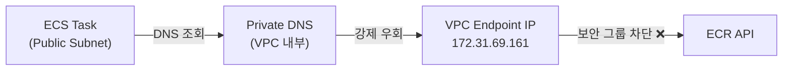
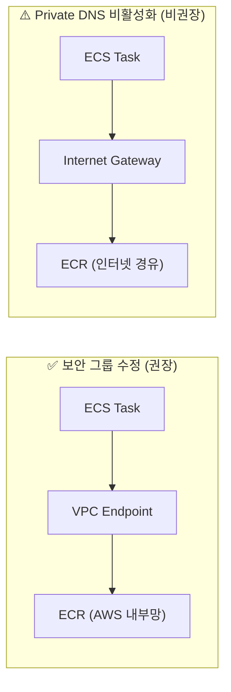

## 문제 배경

ECS 태스크가 `TaskFailedToStart` 오류로 시작에 실패했다. 컨테이너 이미지를 pull하기 위해 Amazon ECR에 연결을 시도했으나 i/o timeout이 발생했고, 최대 재시도 횟수(3회)를 초과하여 태스크가 종료되었다.

```
ResourceInitializationError: unable to pull secrets or registry auth:
The task cannot pull registry auth from Amazon ECR.
operation error ECR: GetAuthorizationToken, exceeded maximum number of attempts, 3,
Post "https://api.ecr.ap-northeast-2.amazonaws.com/": dial tcp 172.31.69.161:443: i/o timeout
```

ECS 태스크는 **퍼블릭 서브넷**에 위치해 있었기 때문에 처음에는 원인을 파악하기 어려웠다. 인터넷 게이트웨이를 통해 ECR에 직접 연결될 것 같은데, 왜 VPC 엔드포인트 IP(`172.31.69.161`)로 요청이 향하는 걸까?

---

## 원인 분석 — Private DNS의 함정

원인은 **VPC 엔드포인트의 Private DNS 활성화** 옵션에 있었다.

ECR VPC 엔드포인트 생성 시 Private DNS가 활성화되어 있으면, VPC 내 **모든 서브넷**에서 ECR 도메인이 자동으로 VPC 엔드포인트 IP로 resolve된다. 퍼블릭 서브넷도 예외가 없다.

```
# Private DNS 활성화 시 → DNS가 VPC 엔드포인트 IP로 강제 우회
api.ecr.ap-northeast-2.amazonaws.com → 172.31.69.161 (VPC Endpoint IP)

# 원래 기대했던 동작
api.ecr.ap-northeast-2.amazonaws.com → 52.x.x.x (ECR 퍼블릭 엔드포인트)
```

트래픽 흐름이 아래와 같이 꼬인 것이다.



VPC 엔드포인트의 보안 그룹이 ECS 태스크의 보안 그룹을 허용하지 않았기 때문에 연결이 차단된 것이다.

---

## 해결 방법

### 실제 적용한 방법 — 보안 그룹 수정 (권장)

ECR VPC 엔드포인트 보안 그룹에 회사 default VPC 전체 대역에서 오는 HTTPS 인바운드 규칙을 추가했다.

| 항목 | 값                                    |
| ---- | ------------------------------------- |
| 유형 | HTTPS                                 |
| 포트 | 443                                   |
| 소스 | 172.31.0.0/16 (default VPC 전체 대역) |

동일 VPC 내 모든 리소스에서 엔드포인트로의 접근이 허용되므로, 향후 ECS 서비스가 추가되더라도 별도 보안 그룹 수정 없이 동일하게 적용된다.

### 대안 — Private DNS 비활성화 (비권장)

ECR VPC 엔드포인트의 Private DNS를 끄면 트래픽이 인터넷 게이트웨이를 통해 ECR 퍼블릭 엔드포인트로 직접 나간다. 설정은 간단하지만 트래픽이 인터넷 구간을 경유하게 되어 보안/비용 면에서 불리하다.



---

## VPC 엔드포인트 + Private DNS를 유지해야 하는 이유

**1. 트래픽이 AWS 내부망에서만 흐름**
컨테이너 이미지에는 애플리케이션 코드, 설정값 등 민감한 내용이 포함될 수 있다. Private DNS + VPC 엔드포인트를 쓰면 이 트래픽이 인터넷 구간을 전혀 거치지 않는다.

**2. 코드 변경 없이 자동 적용**
Private DNS가 없으면 엔드포인트 URL을 코드에 명시적으로 지정해야 한다. Private DNS가 있으면 기본 설정 그대로 사용 가능하다.

**3. 비용 절감**
이미지 pull이 잦고 용량이 크다면 인터넷 데이터 전송 비용보다 VPC 엔드포인트가 더 저렴한 경우가 많다.

**4. 보안 컴플라이언스 충족**
HIPAA, SOC2, ISO27001 등 보안 인증 환경에서는 "외부 인터넷을 경유하지 않는다"는 것을 증명해야 하는 경우가 많다. VPC 엔드포인트 구성이 이 요건을 충족하는 표준적인 방법이다.

---

## 정리

퍼블릭 서브넷이라도 VPC 엔드포인트 + Private DNS가 활성화되어 있으면, DNS 레벨에서 트래픽이 강제로 엔드포인트로 우회된다. 보안 그룹이 맞지 않으면 연결이 차단되므로, Private DNS를 끄는 것보다 **보안 그룹을 정리하는 방향으로 해결하는 것을 권장한다.**
