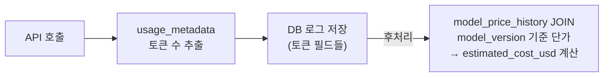

## 왜 LLM 비용 추적이 필요한가

LLM API는 요청마다 비용이 발생하는 종량제 모델이다. 토큰 수, 모델 종류, 캐싱 여부, 부가 기능 사용 여부에 따라 비용이 천차만별로 달라진다. 로그 없이 운영하면 어떤 기능이 얼마나 쓰이는지, 어디서 비용이 튀는지 전혀 알 수 없다.

이 글에서는 Gemini API를 예시로, **비용 추적에 필요한 데이터가 무엇인지**와 **DB 로그 설계 및 후처리 흐름**을 정리한다.

---

## Gemini API 비용 구조 (2026년 3월 기준)

Gemini 비용은 크게 두 가지 축으로 결정된다.

### 모델별 단가

| 모델                  | 입력 ($/1M tokens)            | 출력 ($/1M tokens) |
| --------------------- | ----------------------------- | ------------------ |
| Gemini 2.5 Pro        | $1.25 (≤200K) / $2.50 (>200K) | $10.00 / $20.00    |
| Gemini 2.5 Flash      | $0.30                         | $2.50              |
| Gemini 2.5 Flash-Lite | $0.10                         | $0.40              |

Pro 모델은 컨텍스트가 200K 토큰을 초과하면 단가가 2배가 된다.

### 비용에 영향을 주는 추가 요소

- **캐시 토큰**: 컨텍스트 캐싱이 적용된 토큰은 입력 단가의 10%만 과금
- **Thinking 토큰**: Gemini 2.5 계열 모델의 추론 과정 토큰, 출력 단가로 과금
- **Google Search 그라운딩**: 검색 결과를 응답에 근거로 첨부하는 기능. 쿼리당 $35/1K (모델에 따라 상이)
- **배치 처리**: 50% 할인 (비긴급 워크로드)
- **에러 응답**: 400/500 에러는 토큰 미과금 (단, 쿼터 카운트에는 포함)

---

## 저장해야 할 데이터

### API 응답에서 추출할 수 있는 것

모든 Gemini API 응답에는 `usage_metadata` 객체가 포함된다.

```python
# 실제 SDK에서는 객체 속성으로 접근 (response.usage_metadata.prompt_token_count)
# 아래는 구조를 보여주기 위한 의사코드
response.usage_metadata = {
    "prompt_token_count": 1200,         # 전체 입력 토큰 (cached 포함)
    "cached_content_token_count": 400,  # 캐시 히트 토큰 (prompt의 부분집합, 10% 과금)
    "candidates_token_count": 350,      # 출력 토큰
    "thoughts_token_count": 80,         # thinking 토큰 (출력 단가)
    "total_token_count": 1630           # prompt + candidates + thoughts
}
```

### 비용 역산에 필요한 추가 정보

토큰 수만 있어도 나중에 역산이 가능하지만, 이를 위해 함께 저장해야 하는 필드가 있다.

- **`model_version`**: 설정한 모델명(`model`)이 아닌, 응답에서 돌아온 실제 버전. 버전마다 단가가 다를 수 있어 역산의 기준이 된다.
- **`http_status`**: 400/500 에러는 미과금이므로 과금 여부 판단에 필요하다.

---

## DB 로그 테이블 설계

아래는 실제 운영 환경을 고려한 설계 예시다.

```sql
create table llm_api_logs
(
    id              bigint auto_increment primary key comment 'PK',
    member_id       bigint       not null comment '유저 ID',
    model           varchar(50)  not null comment '설정 모델명 (e.g. gemini-2.5-flash)',
    model_version   varchar(50)  null     comment '응답의 실제 모델 버전',
    attempt         int          not null comment '시도 번호 (1=최초, 2+=재시도)',
    input_tokens    int default 0 not null comment '입력 토큰 수 (promptTokenCount)',
    output_tokens   int default 0 not null comment '출력 토큰 수 (candidatesTokenCount)',
    thinking_tokens int default 0 not null comment 'thinking 토큰 수',
    cached_tokens   int default 0 not null comment '캐시된 토큰 수',
    total_tokens    int default 0 not null comment '총 토큰 수',
    latency_ms      bigint default 0 not null comment 'API 응답 지연 시간 (ms)',
    http_status     int          null     comment 'HTTP 상태 코드',
    finish_reason   varchar(30)  null     comment '종료 사유 (STOP, MAX_TOKENS 등)',
    success         tinyint(1)   not null comment '성공 여부',
    error_message   longtext     null     comment '에러 메시지',
    created_at      datetime(6) default current_timestamp(6) not null
) comment 'LLM API 호출 로그';

create index idx_created_at on llm_api_logs (created_at);
create index idx_member_id on llm_api_logs (member_id);
create index idx_model_created on llm_api_logs (model, created_at);
```

### 필드 설계 포인트

**`model`과 `model_version`을 분리한 이유**

`gemini-2.5-flash`로 요청해도 실제 응답에는 `gemini-2.5-flash-preview-04-17` 같은 버전이 찍힌다. 버전마다 단가가 다를 수 있어 역산 시 기준이 `model_version`이 되어야 한다.

**`cached_tokens`를 별도로 저장하는 이유**

캐시 히트 토큰은 일반 입력 토큰의 10%만 과금되기 때문에, 합산해서 저장하면 역산 시 비용이 부풀려진다.

```
추정 비용 = (input_tokens - cached_tokens) × 입력단가
          + cached_tokens × 입력단가 × 0.1
          + (output_tokens + thinking_tokens) × 출력단가
```

**`attempt`를 저장하는 이유**

LLM API 호출은 타임아웃이나 rate limit 등으로 재시도하는 경우가 많다. 같은 요청에 대해 몇 번째 시도인지를 기록하면 재시도 빈도, 재시도 시 토큰 낭비량 등을 분석할 수 있다.

**`http_status`를 저장하는 이유**

`success = 0`만으로는 에러 종류 구분이 안 된다. 400/500 에러는 Gemini가 토큰을 미과금하므로, 후처리 비용 계산 시 이 케이스를 필터링해야 한다.

---

## 비용 계산 흐름

비용 계산은 실시간이 아닌 **후처리**로 분리하는 것이 좋다. 단가는 자주 바뀌고, 로그 저장과 비용 계산은 관심사가 다르다.



나중에 비용 계산을 추가할 때는 `model_price_history` 테이블 하나만 만들어 `model_version`으로 JOIN하면 된다.

```sql
create table model_price_history
(
    id                bigint auto_increment primary key,
    model_version     varchar(50) not null comment '모델 버전',
    input_price_per_1m  decimal(10, 4) not null comment '입력 토큰 단가 ($/1M)',
    output_price_per_1m decimal(10, 4) not null comment '출력 토큰 단가 ($/1M)',
    effective_from    date not null comment '적용 시작일',
    effective_to      date null    comment '적용 종료일 (null = 현재 적용 중)',
    INDEX idx_model_version (model_version)
);
```

---

## 정리

LLM API 비용 추적의 핵심은 세 가지다.

1. **`usage_metadata`에서 토큰 필드를 분리해서 저장한다** — 특히 `cached_tokens`와 `thinking_tokens`는 단가가 다르므로 반드시 분리해야 역산이 정확하다.
2. **`model_version`을 저장한다** — 설정값(`model`)이 아닌 응답의 실제 버전이 비용 계산 기준이다.
3. **비용 계산은 후처리로 분리한다** — 단가 변경에 유연하게 대응할 수 있고, 로그 저장 로직과 관심사를 분리할 수 있다.

실시간으로 비용 필드를 저장하고 싶다면 `estimated_cost_usd` 컬럼을 추가하고 호출 시점에 계산해서 함께 저장해도 된다. 다만 단가 변경 시 과거 데이터와 불일치가 생길 수 있으므로, 이 경우에도 토큰 필드는 반드시 함께 남겨두는 것을 권장한다.
